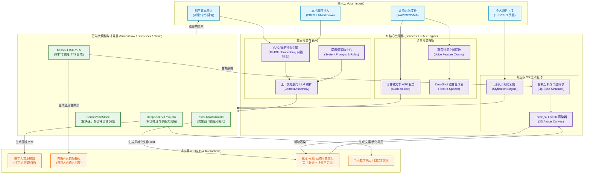

# 🌈 Opclaw — 全能数字资产与AI数字人分身助手 AI能力全景与对接规范

本技术文档旨在为 **Opclaw（全能数字资产与AI数字人分身助手）** 提供全面的 AI 能力全景图、多模态 AI 对接需求、API 成本估算、以及核心提示词策略规范。本规范服务于项目在实际云端落地部署与竞赛演示。

---

## 🗺️ 一、AI能力全景图 (系统架构图)

Opclaw 采用的是基于**云端多模态 API + 本地混合编排**的混合式 AI 架构。以下架构图展示了从用户多源输入到 AI 处理层，再到最终用户多模态输出的完整流转链路：

---

## 📊 二、需要对接的AI能力需求与成本矩阵

针对 Opclaw 的多模态体系，我们需要将目前前端模拟的 RAG 与 Mock 接口全面升级为真实的云端高可用 API。以下按模态分别呈现对应的 API 对接需求与费用估算表：

### 1. 文本模态 (Text Modality) 对接矩阵

| 功能场景 | 对应推荐AI模型 | 云端API服务商 / 端点 | 核心请求参数配置 | 调用价格 / 运行成本 (估算) |
| :--- | :--- | :--- | :--- | :--- |
| **数字分身个性化对话** | DeepSeek-V3 (即 `deepseek-chat`) | DeepSeek 官方 / SiliconFlow `/v1/chat/completions` | `temperature: 0.7` `max_tokens: 300` `stream: true` | 输入: ¥1.00 / 百万 token 输出: ¥2.00 / 百万 token (缓存命中: 输入 ¥0.10 / 百万) |
| **知识库向量化检索** | bge-m3 / text-embedding-3-small | SiliconFlow (BAAI/bge-m3) `/v1/embeddings` | `encoding_format: "float"` `dimensions: 1024` | SiliconFlow `bge-m3` 目前免费试用； 或按标准计费：¥0.07 / 百万 token |
| **内容协同创作、润色与新媒体生成** | DeepSeek-V3 / GPT-4o-mini | SiliconFlow / OpenAI `/v1/chat/completions` | `temperature: 0.6` `top_p: 0.9` | 输入: ¥1.00 / 百万 token 输出: ¥2.00 / 百万 token |
| **智能简历优化与排版** | DeepSeek-V3 | DeepSeek 官方 `/v1/chat/completions` | `temperature: 0.5` `response_format: { "type": "json" }` | 输入: ¥1.00 / 百万 token 输出: ¥2.00 / 百万 token |

### 2. 语音模态 (Audio Modality) 对接矩阵

| 功能场景 | 对应推荐AI模型 | 云端API服务商 / 端点 | 核心请求参数配置 | 调用价格 / 运行成本 (估算) |
| :--- | :--- | :--- | :--- | :--- |
| **实时语音转文字 (ASR)** | **stepaudio-2.5-asr** | 阶跃星辰 Step Plan `/step_plan/v1/audio/asr/sse` | `enable_itn: true` `format: { type: "wav" }` | 约 ¥0.0005 / 秒 (超高性价比转写) |
| **零样本与情感级合成 (TTS)** | **stepaudio-2.5-tts** | 阶跃星辰 Step Plan `/step_plan/v1/audio/speech` | `voice: "linjiajiejie"` `instruction: "温柔语气"` | 约 ¥0.005 / 字 (支持括号内细节语气控制) |
| **大模型语音对话 (Chat)** | **stepaudio-2.5-chat** | 阶跃星辰 Step Plan `/step_plan/v1/chat/completions` | `stream: true` `temperature: 0.7` | 极速流式多模态文本与发音交互 |
| **全双工实时连线对话 (Realtime)** | **stepaudio-2.5-realtime** | 阶跃星辰 Step Plan `wss://api.../v1/realtime` | `turn_detection: { type: "server_vad" }` | 极低延迟的双向 WebSocket 实时流互动 |
| **声音模型专业微调 (开源自建)** | GPT-SoVITS / CosyVoice | 开源自建部署 (AutoDL GPU 云) FastAPI 接口封装 | `temperature: 0.8` `ref_audio_path: string` | 按云服务器计费：RTX 4090 约 **¥1.5 - ¥2.8 / 小时** |

### 3. 视觉与 3D 模态 (Vision / 3D Modality) 对接矩阵

| 功能场景 | 对应推荐AI模型 | 云端API服务商 / 端点 | 核心请求参数配置 | 调用价格 / 运行成本 (估算) |
| :--- | :--- | :--- | :--- | :--- |
| **人像卡通/写实风格化克隆** | Kwai-Kolors/Kolors | SiliconFlow 平台 `/v1/images/generations` | `image_size: "1024x1024"` `guidance_scale: 7.5` `num_inference_steps: 20` | 单张生成成本：**¥0.06 / 张** |
| **3D数字人建模与实时驱动** | Ready Player Me (3D形象) + Live2D Audio SDK (口型) | RPM Web SDK + 本地音频解析算法 (双端静默加载) | `bodyType: "halfbody"` `pose: "pose-relaxed"` `mouthOpenness` 振幅映射 | 3D 模型资产生成免费； 本地口型同步算法零云端成本 |

> [!NOTE]
> SiliconFlow (硅基流动) 在国内提供了优秀的国内骨干网加速和多模型统一定价，非常适合竞赛项目的快速对接。

---

## 📝 三、系统提示词 (Prompt) 策略规范

为保证 Opclaw 的 AI 分身在对话、知识库检索、简历优化及文案创作等场景中保持专业、一致且契合超级个体（OPC）定位的表现，以下制定了五大核心提示词策略：

| 序号 | 策略场景 | 提示词核心模板 (Prompt Template) | 核心设计逻辑与约束约束 |
| :--- | :--- | :--- | :--- |
| **1** | **数字分身个性化对话** (对应 AI 页面对话) | `你是一个亲切、自然且富有共情感的AI分身助手。你拥有用户的完整知识库、生活记录和工作资料。你的目标是基于提供的背景知识，像用户的"数字双胞胎"一样进行对话。`  **约束规则：** `1. [内容检索]：优先基于以下检索内容资产回答：{context}。如果未找到相关内容，基于常识回答并客观说明。` `2. [对话风格]：语调必须自然友好，如朋友般交流，文字有温度。` `3. [格式约束]：每条回复的开头必须包含一个适当的 emoji 表情；结尾绝对不得添加任何表情；内容长度必须严格限制在四行以内；使用流式输出。` | **双胞胎人设 + 严格格式控制**： 1. 通过 `{context}` 注入用户的个人特长、日记、旅行地点，确保“数字分身”的名副其实性。 2. 限制“开头有 emoji，结尾绝对没有，且严格在 4 行以内”是为了完美适配 3D 渲染下的对话气泡 UI，避免气泡溢出。 |
| **2** | **RAG 检索知识合成** (对应学习空间) | `你是一个智能学习助手。下面是根据用户提问，在用户的个人云端知识库中匹配到的相关文档片段：` `---` `{retrieved_chunks}` `---` `请你仔细阅读上述材料，并按照以下要求回答用户的问题【{user_query}】：` `1. 仅根据上述提供的文档内容进行提问解答。若材料中不包含答案，请礼貌地回答：“抱歉，在您的个人知识库中未找到相关直接记录，以下是基于通用通用常识的解答...”。` `2. 严禁捏造事实和虚构用户的个人学习背景。` `3. 在你的回答末尾，用括号标注出引用的文章标题或来源模块，如：(来源: 学习空间 - {source_title})。` | **严格的信息还原度 (Truthfulness)**： 1. 防止 LLM 的幻觉和虚假学习成果创造，保护个人知识资产的真实性。 2. 指明来源标注（Attribution）能够让用户双击来源即可快速定位原文章，实现了优秀的知识图谱闭环。 |
| **3** | **简历智能润色优化** (对应简历生成器) | `你是一名资深的 HR 行业专家与资深简历顾问。你的任务是帮助用户优化其项目经历和专业技能描述，使其符合国际标准的简历撰写规范（如 STAR 法则）。`  **优化指令：** `请对以下项目经历进行重构：{resume_section_input}` **重构规范：** `1. 严格采用 STAR 法则：阐述情境 (Situation)、任务 (Task)、行动 (Action)、以及最终成果 (Result)；` `2. 词汇优化：使用强动词开头（例如：主导、优化、重构、落地、提升）；` `3. 量化成果：必须引导用户或自动推导至少一个可量化的数据结果（如：响应时间缩短 30%、运营成本降低 15%）；` `4. 格式：输出 Markdown 列表，简明扼要，直奔主题，避免空洞的套话。` | **STAR 原则驱动与量化思维**： 1. 普通独立开发者的简历往往平铺直叙，缺乏亮眼数据。该 Prompt 强行将非结构化文本规范为 STAR 模式。 2. 强化动词选用和可量化指标，大幅增加求职与 IP 展示的说服力。 3. 适配 `ResumeBuilder.tsx` 页面。 |
| **4** | **文章协同创作与提炼** (对应 Tiptap 富文本) | `你是一个专为超级个体打造的高效写作总编辑。现在，用户在富文本编辑器中选中了一段文本内容：` `=== 选中内容 ===` `{selected_text}` `=== 上下文背景 ===` `{context_text}`  **执行任务 (根据用户选择，执行以下四选一)：** `A. 润色：纠正语法错误，调整语序，提升文学修辞和专业度。` `B. 扩写：在保留主旨的前提下，增加细节、应用场景和例证，扩展篇幅。` `C. 提炼摘要：将内容提炼为 150 字以内的精炼导读或结论。` `D. 标签提取：分析核心概念，提取 3-5 个技术或生活标签（以逗号分隔，如：React, Three.js, RAG）。` **输出约束**：直接返回处理后的正文文本，不要带任何“好的，以下是...”等解释性前言。` | **高吞吐无废话输出 (Zero-shot Direct Response)**： 1. 专为富文本编辑器的“划词替换”而设计，多余的修饰性前言会破坏用户的编辑排版，故要求“直接返回处理后的正文”。 2. 区分四种创作子任务，全面赋能独立创作者。 3. 适配 `ArticleEditor.tsx` 中的选区编辑操作。 |
| **5** | **电商与新媒体运营文案** (对应工作助手) | `你是一个精通跨平台传播规律的新媒体爆款文案专家。请根据以下商品/内容信息：{product_info}，生成适合在【{platform_name}】发布的营销推广文案。`  **平台风格映射规则（极其重要）：** `- 小红书：语气必须软萌活泼，多用“宝子们”、“家人们”；善用双感叹号；首句包含痛点唤醒；文案中必须密集穿插 Emoji（每行 1-2 个）；结尾附带热门话题标签。` `- 微信公众号：排版结构清晰，语气温和有说服力，多使用小标题分段，提供深度价值。` `- 微博：文案限制在 140 字内，首句为加粗的话题标签（如 #独立开发者的日常#），语气精炼、富有网感。` `- 抖音：输出 30 秒的短视频口播脚本，前 3 秒必须有黄金钩子（Hook）吸引留存，包含分镜头动作提示。` | **多平台受众精准画像匹配**： 1. 针对超级个体需要在多渠道分发同一资产的痛点，该策略实现了“一键转换平台风格”，将原始产品参数转变为带有情绪价值的爆款文案。 2. 对小红书和抖音短视频的特定结构（Hook/Emoji）做了强力规范。 3. 适配 `WorkAssistant.tsx` 中电商运营和新媒体运营模块。 |

---

## 🛡️ 四、高可用多级容灾与本地优化方案

为确保 Opclaw 项目在弱网环境或 API 额度不足/服务商宕机时仍能平稳演示和运行，设计了多级容灾体系：

### 1. RAG 知识检索容灾机制
*   **一级检索 (向量检索)**：尝试调用云端 Embedding 并请求 Supabase PGVector 向量数据库，计算余弦相似度。
*   **二级检索 (本地 TF-IDF，已在 `ragEngine.ts` 落地)**：若云端 API 超时，立即降级为本地纯 JS 实现的关键词提取加权匹配，从 mock 数据和已拉取的本地 indexedDB 中进行匹配。
*   **三级兜底 (意图模板库)**：若检索未触发，根据用户提问的关键词（如“你好”、“技能”、“旅行”），直接匹配预设的静态意图回复模板（见 `ragEngine.ts:generateResponse`），保证 100% 的应答率。

### 2. ASR (语音识别) 容灾机制
*   **云端 ASR**：优先使用 SiliconFlow 提供的 SenseVoiceSmall API 进行高质量音频翻译。
*   **本地 Web Speech API 监听**：若网络离线或 API 报 500/403，前端自动回退至现代浏览器自带的 `webkitSpeechRecognition` 接口，在前端无感完成语音转换为文字。

### 3. TTS (语音播报) 容灾机制
*   **云端 Zero-Shot TTS**：优先采用 MOSS-TTSD-v0.5 通过用户的克隆声音特征合成个性化语音。
*   **本地 Web Speech 朗读**：当服务降级时，前端利用 Web Speech API 的 `window.speechSynthesis` 调用操作系统自带的合成音色（如 Microsoft Xiaoxiao），以极低的延迟完成回复朗读，维持 3D 人物的口型同步。

### 4. Live2D 极简口型同步设计
如 `ttsService.ts` 所示，通过将生成的 MP3 音频转为 WAV PCM 的 ArrayBuffer，实时读取音频振幅，直接将音频振幅映射至 Live2D 的 `mouthOpenness` 嘴形张合度，实现完美的本地化实时口型渲染，无需依赖昂贵的视频流驱动服务。

---

## 🚀 五、未来 AI 能力升级线路图 (Roadmap)

1.  **WebGPU 本地端侧模型部署**：
    *   在主流浏览器中利用 WebGPU 技术直接加载 WebLLM 框架，实现本地运行 Llama-3-8B 等端侧模型，实现 100% 隐私安全与零调用资费。
2.  **多 Agent 协同工作流**：
    *   引入 LangChain 或 Autogen 工作流，让新媒体助手、电商助手和简历顾问之间能够自动协作（例如：简历顾问发现用户技能更新，自动触发新媒体助手生成一篇分享推文）。
3.  **高级视频流数字人替代**：
    *   接入 SadTalker 或 HeyGen API，将当前的 2D 图片风格化形象升级为口型与表情完全逼真的高保真视频流数字人分身。
