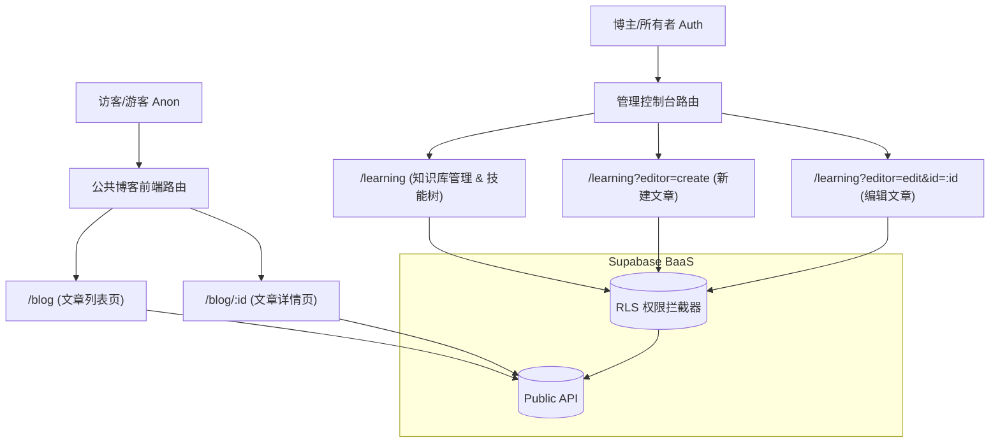
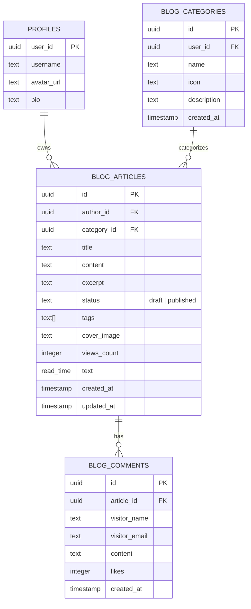

# 📝 Opclaw 学习空间升级博客系统技术实现方案 (bg.md)

本篇文档详细描述了将现有的“学习空间”全面升级为具备专业内容管理、社交分享、访客访问以及 AI 集成的博客系统的技术实现方案与开发计划。

---

## 一、 系统架构设计

升级后的博客系统将采用前后端分离的现代化架构，基于现有的 **React 19 + Vite 7 + Supabase + Tailwind CSS 4** 架构栈进行扩展。

### 1. 访问角色与路由划分

为实现“互联网游客免登录访问”与“作者安全管理”的隔离，系统将重新规划路由结构：



*   **公共路由（游客/读者访问）**：
    *   `/blog`：博客列表页。以卡片网格形式展示所有**已发布 (status='published')** 的文章，提供分类筛选、标签搜索功能。
    *   `/blog/:id`：博客详情页。展示文章排版好的富文本内容、目录索引（TOC）、文章分享入口，以及留言评论区。
*   **管理路由（仅作者/博主可访问）**：
    *   `/learning`：保持原有“学习空间”的入口，但在此视图中，如果当前用户未登录或非主页拥有者，界面自动降级为“只读知识库模式”；若为拥有者，则开启新建、编辑、删除、导入、存草稿等完整控制权。

### 2. 核心模块与数据流向

1.  **富文本编辑器模块**：升级 Tiptap 配置，接入 `Image` + `Link` + `Placeholder` + `CodeBlockLowlight`。实现图片拖拽/粘贴拦截，直接上传至 Supabase Storage 并转换为 URL 插入编辑器。
2.  **社交分享与卡片生成模块**：使用 Canvas API（或 `html2canvas`）在前端拼装背景图、文章标题、摘要、作者头像及文章二维码，生成高清 PNG 格式卡片供用户下载。
3.  **评论/留言交互模块**：游客无需注册，只需填写“昵称”和“邮箱/联系方式”即可发表评论。为防刷评论，前端做基本的防抖与验证，后端配置行级安全策略（RLS）防止未授权篡改。
4.  **AI 助手集成模块**：AI 助手不仅可对全局文章进行检索，还可基于当前阅读的文章提供 RAG（检索增强生成）问答。对于未发布的草稿，AI 仅对拥有者可见；对于已发布的文章，游客也可以在侧边栏唤起 AI 助手提问。

---

## 二、 数据库设计 (Database Schema)

在 Supabase PostgreSQL 中新增及扩展以下表结构，并配备必要的索引和 RLS（行级安全）规则。

### 1. 数据库关系图



### 2. 表结构定义 (SQL Migrations)

```sql
-- 1. 博客分类表
create table if not exists public.blog_categories (
  id uuid primary key default gen_random_uuid(),
  user_id uuid not null references public.profiles (user_id) on delete cascade,
  name text not null,
  icon text, -- 存储 Emoji 或图标类名
  description text default '',
  created_at timestamp with time zone default now() not null,
  unique (user_id, name)
);

-- 2. 博客文章表
create table if not exists public.blog_articles (
  id uuid primary key default gen_random_uuid(),
  author_id uuid not null references public.profiles (user_id) on delete cascade,
  category_id uuid references public.blog_categories (id) on delete set null,
  title text not null,
  content text not null, -- 存储 HTML 或 Markdown
  excerpt text default '',
  status text not null default 'draft', -- 'draft' (草稿) 或 'published' (已发布)
  tags text[] default '{}'::text[],
  cover_image text,
  views_count integer not null default 0,
  read_time text,
  created_at timestamp with time zone default now() not null,
  updated_at timestamp with time zone default now() not null
);

-- 创建索引以加速检索
create index if not exists idx_articles_author on public.blog_articles (author_id);
create index if not exists idx_articles_status_created on public.blog_articles (status, created_at desc);
create index if not exists idx_articles_tags on public.blog_articles using gin (tags);

-- 3. 博客评论表 (游客友好)
create table if not exists public.blog_comments (
  id uuid primary key default gen_random_uuid(),
  article_id uuid not null references public.blog_articles (id) on delete cascade,
  visitor_name text not null,
  visitor_email text,
  content text not null,
  likes integer not null default 0,
  created_at timestamp with time zone default now() not null
);

create index if not exists idx_comments_article on public.blog_comments (article_id);
create index if not exists idx_comments_created on public.blog_comments (created_at desc);
```

### 3. 行级安全策略 (RLS Policies)

为了保证“免登录浏览 + 安全管理”的权限隔离，必须对这三张表应用正确的 RLS 策略：

```sql
-- 开启行级安全
alter table public.blog_categories enable row level security;
alter table public.blog_articles enable row level security;
alter table public.blog_comments enable row level security;

----------------------------------------
-- BLOG_CATEGORIES 策略
----------------------------------------
-- 允许所有人浏览分类（包括未登录游客）
create policy "Allow public view categories"
  on public.blog_categories for select
  using (true);

-- 仅允许登录博主对其分类进行增删改
create policy "Allow author manage own categories"
  on public.blog_categories for all
  to authenticated
  using (auth.uid() = user_id)
  with check (auth.uid() = user_id);

----------------------------------------
-- BLOG_ARTICLES 策略
----------------------------------------
-- 允许所有人查看已发布的文章；如果用户是博主本人，可以查看所有文章（包括草稿）
create policy "Allow select articles"
  on public.blog_articles for select
  using (
    status = 'published' 
    or (auth.uid() is not null and auth.uid() = author_id)
  );

-- 仅允许作者本人修改/删除/添加文章
create policy "Allow author manage own articles"
  on public.blog_articles for all
  to authenticated
  using (auth.uid() = author_id)
  with check (auth.uid() = author_id);

----------------------------------------
-- BLOG_COMMENTS 策略
----------------------------------------
-- 允许所有人查看评论
create policy "Allow public view comments"
  on public.blog_comments for select
  using (true);

-- 允许所有人（包括游客 anon）新增评论
create policy "Allow public insert comments"
  on public.blog_comments for insert
  with check (true);

-- 仅允许博主删除不当评论
create policy "Allow author delete comments"
  on public.blog_comments for delete
  to authenticated
  using (
    exists (
      select 1 from public.blog_articles a 
      where a.id = blog_comments.article_id 
      and a.author_id = auth.uid()
    )
  );
```

---

## 三、 API 接口与集成规划

前端通过 `Supabase-js` SDK 直接进行安全的 RESTful 调用，极大简化了后端中间层。

### 1. 客户端主要 API 交互方法

| API 描述 | 访问权限 | Supabase-JS 调用示例 |
| :--- | :--- | :--- |
| **获取所有已发布文章** | 所有人 (匿名) | `supabase.from('blog_articles').select('*').eq('status', 'published').order('created_at', { ascending: false })` |
| **获取文章详情** | 所有人 (匿名) | `supabase.from('blog_articles').select('*, blog_categories(*)').eq('id', id).single()` |
| **文章浏览数递增** | 所有人 (匿名) | `supabase.rpc('increment_article_views', { article_id: id })` *(需注册PostgreSQL RPC函数)* |
| **添加游客评论** | 所有人 (匿名) | `supabase.from('blog_comments').insert([{ article_id, visitor_name, visitor_email, content }])` |
| **保存文章（草稿/发布）** | 仅限博主 | `supabase.from('blog_articles').upsert({ id, title, content, status, category_id, tags, cover_image })` |

### 2. 关键辅助功能 API：图片云存储转换

目前前端文章编辑器使用的是 Base64 格式存储图片，极易造成数据庞大和加载缓慢。本升级方案强制要求实现 **图片自动上传云存储并替换为 URL** 流程：

```javascript
// 富文本编辑器图片粘贴/拖拽上传处理逻辑
async function handleImageUpload(file: File): Promise<string> {
  const fileExt = file.name.split('.').pop();
  const fileName = `${Math.random().toString(36).substring(2)}_${Date.now()}.${fileExt}`;
  const filePath = `${supabase.auth.user()?.id}/blog_images/${fileName}`;

  // 上传至 Supabase Storage 的 public-assets Bucket
  const { data, error } = await supabase.storage
    .from('public-assets')
    .upload(filePath, file);

  if (error) throw error;

  // 获取公共可访问 URL
  const { data: { publicUrl } } = supabase.storage
    .from('public-assets')
    .getPublicUrl(filePath);

  return publicUrl;
}
```

---

## 四、 核心功能实现要点

### 1. 内容管理与状态控制 (Draft vs Published)
在保存文章时，提供“保存为草稿”与“确认发布”两个按钮。
*   `status = 'draft'` 的文章对游客接口不可见，且在博主的管理控制台中标注为“草稿”状态。
*   `status = 'published'` 的文章才会在公共路由 `/blog` 中展示，同时触发 Supabase Webhook，可选择性同步更新 AI 向量检索库的索引。

### 2. 社交分享与海报生成卡片

每篇博文的顶部或右下角提供一个“分享”按钮，点击后弹出美观的卡片模版：
*   **卡片设计**：包含高颜值的渐变色背景、文章标题、首段摘要、作者头像及当前文章详情页的专属 QR 码（使用 `qrcode` 包自动生成）。
*   **实现方案**：在 React 中创建一个离屏的 `<canvas>`，使用 Canvas 2D 上下文依次绘制背景、文字、圆角图片，绘制完成后使用 `canvas.toDataURL('image/png')` 输出图片 Base64 串，访客可直接右键保存或一键“保存卡片到本地”。
*   **分享平台快捷入口**：
    *   **微信/朋友圈**：弹出二维码，游客直接手机扫码即可。
    *   **QQ**：使用标准的 `https://connect.qq.com/widget/shareqq/index.html?url=...` 链接拉起。
    *   **复制链接**：使用 `navigator.clipboard.writeText` 实现一键复制。

### 3. 访客友好型界面设计与 SEO 优化

1.  **极速加载**：公共列表页 `/blog` 和详情页 `/blog/:id` 剥离复杂的 3D 渲染和高耗能动画，仅保留精美的 CSS 渐变、毛玻璃质感（Glassmorphism）和微妙的微交互。
2.  **SEO 友好**：
    *   使用 `react-helmet-async` 动态更新网页的 `<title>` 和 `<meta name="description">`。
    *   向页面中注入 Open Graph 和 Twitter 卡片元数据，保证在分享到社交平台时，缩略图和标题解析正常。
3.  **评论区**：设计精美的扁平化留言板，游客评论支持实时更新（利用 Supabase Realtime 订阅通道，让讨论区显得生机勃勃）。

---

## 五、 开发规划与优先级 (Milestones & Roadmap)

开发过程将分为三个迭代周期：

| 阶段 | 核心任务 | 开发要点 | 优先级 |
| :--- | :--- | :--- | :--- |
| **Phase 1<br>(基础搭建)** | **1. 数据库与安全机制**<br>**2. 路由重隔**<br>**3. 状态管理迁移** | * 跑通 Supabase SQL 迁移脚本，应用 RLS 权限策略。<br>* 新增 `/blog` 与 `/blog/:id` 路由，并适配 PC 端和移动端响应式布局。<br>* 使用 Mock 数据测试无登录浏览状态。 | **P0 (核心核心)** |
| **Phase 2<br>(功能升级)** | **1. 编辑器升级**<br>**2. 内容管理控制台**<br>**3. 游客评论系统** | * 扩展 Tiptap 支持拖拽粘贴图片，后台对接 Supabase Storage 转换。<br>* 升级 `/learning` 界面，增加草稿/发布状态控制，支持新建、编辑、删除。<br>* 接入评论区表单，开启 Supabase Realtime 频道。 | **P1 (功能完善)** |
| **Phase 3<br>(增值体验)** | **1. 分享卡片生成器**<br>**2. 社交一键分享弹窗**<br>**3. AI 助手深度集成** | * 利用 Canvas/qrcode 在前端生成精美的文章图片分享卡片。<br>* 实现 QQ/微信 分享弹窗及链接复制功能。<br>* 更新 AI 向量检索流程，支持游客在详情页针对本篇文章进行 AI 提问。 | **P2 (体验飞跃)** |

---
*规划时间：2026-05-27 | 架构师：Antigravity*
