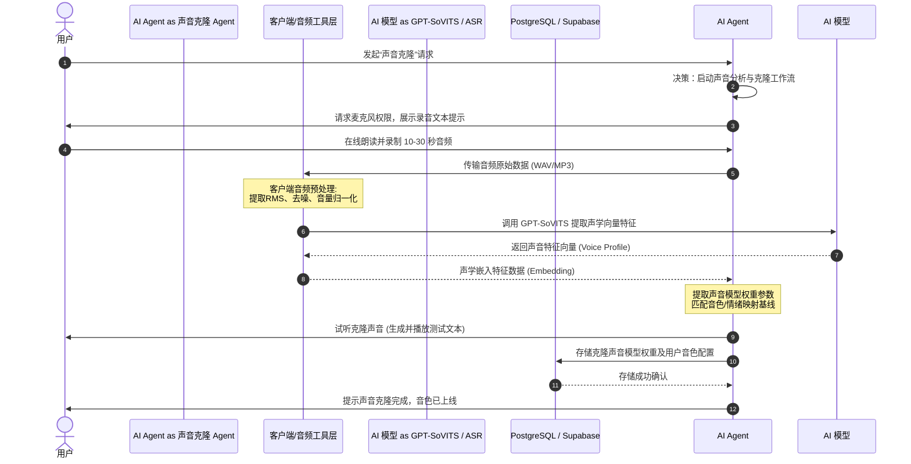
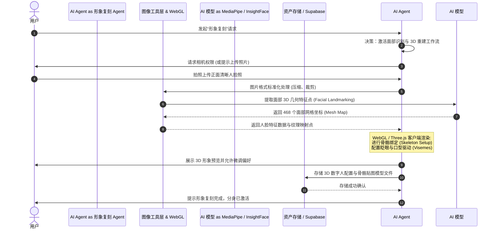
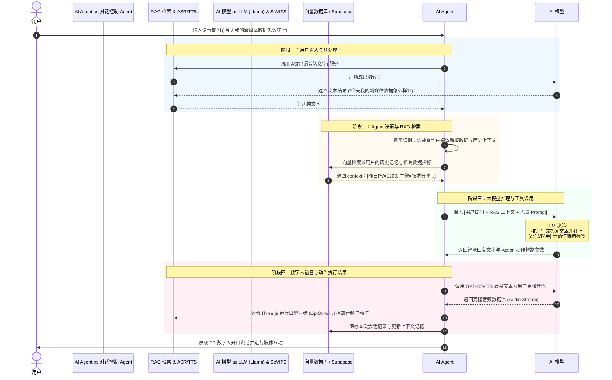

# 🤖 Opclaw 数字人三步骤 Agent 工作流程图指南

本篇文档模仿了时序流程图（Sequence Diagram）的样式，为您梳理并还原了 Opclaw 项目中 **声音克隆**、**形象复刻**、以及 **AI数字人对话** 三个核心 Agent 模块的具体执行链路，包括模型选型、输入输出、工具层调用及数据库读写逻辑。

---

## 🎙️ 工作流 1：声音克隆 Agent 工作流程 (Voice Cloning)

声音克隆 Agent 负责采集用户少量的语音样本，提取声学特征，并训练/构建个性化的声音包。

### 1. Mermaid 时序图

### 2. 详细执行步骤说明

*   **用户层**：发起声音克隆，授权麦克风并完成 10~30 秒的短音频录制。
*   **AI Agent**：负责状态机控制，引导用户完成录制，并决定声音文件的截取与调用特征提取模型。
*   **工具层**：执行音频前处理（如去除杂音、限制音量范围、采样率转换），并将干净音频传输到云端/本地推理模块。
*   **AI 模型 (GPT-SoVITS)**：使用少样本 TTS 声音克隆技术，通过对录制的音频样本进行自适应微调，生成对应的音色特征权重（Speaker Embedding）。
*   **数据库层**：在数据库中持久化存储用户专属的音色特征 ID 以及关联的文件存储链接。

---

## 👤 工作流 2：形象复刻 Agent 工作流程 (Avatar Creation)

形象复刻 Agent 负责通过照片提取用户的面部网格与几何信息，并结合 3D 渲染引擎构建个性化虚拟形象。

### 1. Mermaid 时序图

### 2. 详细执行步骤说明

*   **用户层**：上传一张高清人脸照片，或直接调用前置摄像头拍摄。
*   **AI Agent**：启动图像分析，引导用户将脸部对准取景框，检测光线是否充足。
*   **工具层**：对原始图像进行亮度和对比度优化，对齐眼部和嘴部区域。
*   **AI 模型 (MediaPipe/InsightFace)**：检测人脸关键点，重建面部 3D 拓扑结构，生成纹理映射图（UV Map）。
*   **WebGL / Three.js**：在前端执行骨骼绑定和面部动作捕捉映射（Visemes），为数字人的嘴巴、眼睛和面部肌肉配置表情参数。
*   **数据库层**：将生成的 3D 模型配置文件（如 JSON/GLTF 结构）以及预设的主题场景绑定存储到数据库中。

---

## 💬 工作流 3：AI数字人对话 Agent 工作流程 (AI Chat & Decision Loop)

数字人对话 Agent 是 Opclaw 的大脑核，它包含了完整的“用户输入 → Agent 决策 → 工具调用 → 执行结果”的闭环决策流。

### 1. Mermaid 时序图

### 2. 详细执行步骤说明

*   **阶段一：用户输入与预处理**：用户通过语音输入时，声音经由 ASR 识别模块转为纯文本；如果直接输入文本，则直接跳到阶段二。
*   **阶段二：Agent 决策与 RAG 检索**：Agent 接收文本后，通过预处理进行意图分析。它判定用户正在询问新媒体数据，于是向 Supabase/向量数据库发起查询，检索当前关联的运营指标数据和历史对话记忆。
*   **阶段三：大模型推理与工具调用**：Agent 将“用户问题 + 数据库提取的实时指标 + 系统人设 Prompt”打包发送给大语言模型（LLM）。大模型生成结构化的回复文本，并在文本中标记情绪和动画指令（例如：`{text: "今天的数据增长了20%！", emotion: "happy", action: "wave_hand"}`）。
*   **阶段四：执行结果与渲染**：Agent 拦截大模型的输出，首先调用声音克隆 TTS 模型（GPT-SoVITS）按当前用户的声线渲染音频，其次在前端唤醒 Three.js，将音频包与 3D 口型同步混合器绑定，最后在网页上呈现出栩栩如生的数字分身，让其声形并茂地向用户做出答复。
