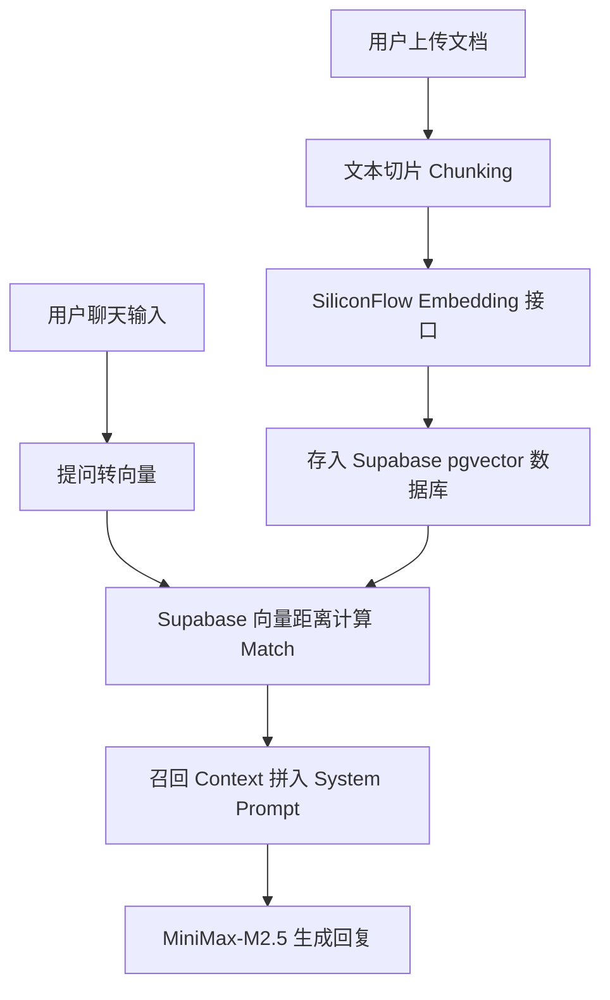

# 🗺️ Opclaw 项目后续功能开发计划与路线图 (pa.md)

本篇文档为 **Opclaw 全能数字资产与AI数字人分身助手** 设计了后续的新增必备功能及特色功能开发计划。计划按优先级分级（P0：极其紧急与核心，P1：重要与实用，P2：特色与差异化体验），并规范了各个功能的输入输出以及推荐技术栈。

---

## 一、 后续开发计划明细表 (必备功能与特色功能)

| 功能分类 | 功能名称 | 功能描述 | 输入 | 输出 | 推荐技术栈 | 优先级 |
| :--- | :--- | :--- | :--- | :--- | :--- | :--- |
| **必备功能 (Essential)** | **生活/工作模块全量云同步** | 建立数据库表以替代 Mock 数据。迁移旅行足迹、生活朋友圈、恋爱倒计时事件、新媒体内容库与电商订单数据，实现多端同步与持久化。 | 前端表单操作 (增删改) | Supabase 数据库表状态更新及实时云端获取的数据 | Supabase PostgreSQL, RLS (行级安全机制) | **P0** (核心必备) |
| | **云端向量检索 (Vector RAG)** | 弃用客户端 TF-IDF 文本匹配。采用云端向量数据库进行相似度检索，支持深度语义匹配与大规模文档库检索。 | 用户查询文本、导入的 PDF/Markdown 文章 | 语义关联度最高的 Context (知识上下文) 文本段落 | Supabase Vector (pgvector), SiliconFlow Embedding API | **P0** (核心必备) |
| | **AI 服务密钥代理转发层 (Edge Proxy)** | 在后端/云函数中托管 ModelScope 与 SiliconFlow API 密钥。前端通过代理层访问 AI 服务，彻底解决客户端 API 密钥泄漏的问题。 | 前端 Chat/TTS/ASR 请求与上下文 | AI 模型返回的流式文本、音频二进制流或图像链接 | Supabase Edge Functions (Deno), TypeScript | **P0** (安全必备) |
| | **PDF/Word 高清简历导出** | 重构简历导出机制，提供多种精美简历模版，支持一键无损导出为标准 A4 排版的高清 PDF/Word 文件。 | 简历编辑表单数据、模版选择 | 浏览器下载的高清 PDF 或 Docx 字节流 | `pdfmake` (客户端PDF生成), `docx.js` | **P1** (体验必备) |
| **特色功能 (Unique)** | **数字分身网页自动获客 Agent (Virtual Twin Lead)** | 在用户的个人主页放置一个常驻的“AI 代理人分身”弹窗。来访客户可与其聊天，AI 分身可基于用户知识库答疑，并自动收集来访者联系方式、预约会议。 | 访客提问文本、预约时间、联系方式 | 留言提醒、Supabase 获客线索列表、飞书/Outlook 日历日程预约通知 | LangChain, Supabase, Calendly / 腾讯会议 API | **P1** (商业特色) |
| | **新媒体多平台 AI 一键分发** | 撰写好内容后，AI 能够自动根据微信公众号、小红书、微博、抖音等不同平台受众特点，优化生成不同的标题与文案排版，并支持一键发布/同步。 | 原始 Markdown 内容 / 图片 / 视频 | 平台适配后的文案草稿、API 自动同步发布的返回状态 | Node.js / Python 爬虫, 微信开放平台/新浪微博/小红书开放 API | **P1** (效率特色) |
| | **数字人音视频合成 (Lip-Sync Video Gen)** | 用户只需输入一段文案，系统能调用用户的 3D/2D 数字形象及克隆音色，直接合成一段口型同步的播报视频，方便快速发抖短视频。 | 播报文字稿、音色配置、数字人动作指令 | 高清 MP4 数字人播报视频下载链接 | SadTalker, LivePortrait (云端推理), SiliconFlow API | **P2** (技术特色) |
| | **AI 社交破冰匹配系统** | 基于超级个体们的个人主页技能标签、近期朋友圈动态、自媒体矩阵内容，AI 自动推荐兴趣/商业契合度高的 OPC 个体，并提供个性化的破冰话题建议。 | 双方用户的 profile、技能标签、新媒体动态 | 契合度评分、破冰话题列表、推荐交友理由 | MiniMax-M2.5 (生成破冰词), 向量相似度算法 (计算契合度) | **P2** (社交特色) |

---

## 二、 核心功能设计方案

### 1. 云端向量检索 (Vector RAG) 实现机制
目前项目在前端使用静态的字符串搜索，无法进行真正的语义理解。优化方案如下：
*   **数据入库**：当用户在“学习空间”导入新文档或新建文章时，前端通过 Supabase Edge Function 将文本切片（Chunking），并调用 SiliconFlow 的 `BAAI/bge-m3` 模型生成 1024 维度的向量（Embedding），随后将其插入 Supabase 中支持 `vector` 类型的 `documents` 表中。
*   **相似度检索**：当用户提问时，系统首先将用户提问文本转化为向量，然后在 Supabase 中执行 `match_documents` 的 RPC 函数，利用余弦相似度（Cosine Distance）快速匹配出 Top-K 的最相关文本切片。

### 2. 自动获客虚拟分身 (Virtual Twin Agent) 工作流
该功能是 OPC 商业变现的利器。当访客进入个人主页后：
1.  **AI 主动打招呼**：数字分身（使用克隆的声音和 3D 模型）主动向来访者发出问候，并说明“我是主人的数字助理”。
2.  **商务咨询与答疑**：访客可以询问“主人有什么项目经验？”、“接不接外包？”、“怎么收费？”等问题，AI 基于个人简历、作品集和知识库进行回答。
3.  **线索收集与日程预约**：如果访客表达了强烈的合作意向，AI 会主动提示“您可以留下您的微信号或手机号，我将立刻通知主人；或者您可以通过下方日历，直接预约主人明天下午的 15 分钟线上会议”。
4.  **即时通知推送**：一旦收集到联系方式或预约成功，通过 Webhook 发送通知到用户的微信或企业微信/飞书。

---
*路线图制定时间：2026-05-25 | 规划人：Antigravity*
