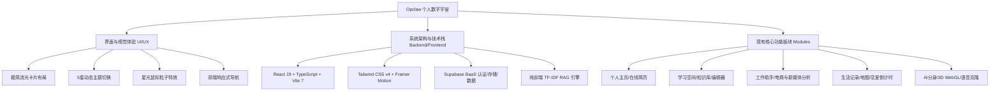

# 🌈 Opclaw 个人主页项目深度分析与后续开发路线图 (pb.md)

本篇文档对 **Opclaw 全能数字资产与AI数字人分身助手** 项目进行全面的界面视觉、交互体验与系统架构分析，结合国内外最前沿的竞品（如 Bento、Linktree、Portaly、Read.cv 等）进行调研对比，并在此基础上为本项目量身制定后续功能开发建议与产品待办列表（Product Backlog）。

---

## 一、 项目当前界面与核心能力全面分析

基于项目截图与代码库的审查，我们对 Opclaw 当前的主页界面及系统底层架构进行深入剖析：

### 1. 界面视觉设计与交互体验分析 (UI/UX)
*   **设计美学与板式**：
    *   截图展示的是 **“极简 (Minimal)”** 主题风格。整体色调为高雅的浅灰色与微渐变星空背景，搭配精致的毛玻璃（Glassmorphism）卡片，营造了极其现代和轻量化的科技感。
    *   **左侧个人画像卡片** 集中展示了头像（带有呼吸灯般的渐变圆环动效）、名字“晓叶”、职业头衔“全栈开发工程师 & AI 研究员”、地理与联络信息，以及包含微信、小红书、抖音、微博、B站的 **社交媒体矩阵图标**。这为个人品牌 IP 提供了极其直观、聚合的展示入口。
    *   **右侧核心成就卡片** 包括一行精炼的个人宣言（Bio）、四个核心量化指标（5+ 年经验、50+ 项目完成、30+ 满意客户、8+ 获得荣誉）以及四个醒目的荣誉徽章（开源贡献者、技术博主、全栈认证、黑客马拉松）。通过卡片式微动效，数据易读性极高。
*   **交互细节与动画**：
    *   **双层切换**：支持“主页”与“简历”的一键无缝标签切换，极大方便了求职和商务对接场景。
    *   **动态粒子拖尾**：全局集成了 `StarCursor` 鼠标跟随效果，页面滑动和悬停时有星光闪烁，增加了产品的灵动性与趣味。
    *   **全局主题控制**：右上角提供了一键主题切换按钮，并支持快捷键 `Shift+Q` 循环切换（极简、赛博、艺术、童趣、复古 5 种风格），这种“多重数字人格”的表达方式非常契合 Z 世代和创作者的个性展示需求。
    *   **管理与分享**：右上角醒目集成了“分享”、“PDF 导出”、“预览”、“编辑”等控制按钮，保证了极高的自主动态配置能力。

### 2. 技术架构与核心亮点 (Architecture)
*   **前沿技术栈**：采用 React 19 + TS + Vite 7 + Tailwind CSS v4。使用 `@tailwindcss/vite` 插件实现极致的构建和编译速度，并基于 Framer Motion 完成丝滑的页面切换过渡与状态交互。
*   **轻量化后端 (BaaS)**：利用 Supabase（PostgreSQL + Auth + Storage + RLS 安全策略）作为云端数据库与存储方案，配合纯前端的 Mock 降级策略，使得系统既具备全栈持久化存储，又能作为零配置的静态网站快速部署。
*   **创新的 AI 与 3D 实验**：
    *   **AI分身**：利用 Three.js（@react-three/fiber）渲染 3D 虚拟形象，并配有声音克隆模拟与基于文本的多模态对话界面，是传统个人主页从未有过的超前体验。
    *   **离线检索 RAG**：本地实现了基于 TF-IDF 的关键词知识检检索引擎，可在无后端大模型服务时实现个人知识库的文章问答。

### 3. 当前版本痛点与可优化方向
1.  **卡片布局静态化**：当前的卡片（如数据统计、简介、荣誉徽章）为写死的板式，虽然能通过 `EditableWrapper` 修改文字，但不支持模块的位置拖拽、增减或大小调整，相比成熟的 Bento.me，灵活性有待提升。
2.  **主页与子空间缺乏联动**：虽然系统集成了“学习空间”、“工作助手”、“生活记录”等极其庞大的功能矩阵，但在“主页”首屏并没有把这些丰富的数据以“小组件 (Widgets)”的形式透出（例如：没有直接展示“最新博客文章”、“最近旅行足迹地图”、“工作助手今日销售额概览”或“恋爱倒计时卡片”）。
3.  **AI 分身尚未打通大模型**：3D 对话采用的是本地预设模板和 TF-IDF 检索，无法进行真正的语义理解、长期记忆或个性化闲聊，制约了“AI分身”概念的真正落地。
4.  **缺乏访客视角的精细化统计**：作为个人主页和数字名片，作者非常渴望知道“谁来看过我”、“哪个链接被点击最多”、“访客的地域分布”等数据，当前版本缺少埋点与数据分析大盘。

---

## 二、 国内外竞品调研与对比分析

为了让 Opclaw 找准定位、博采众长，我们对国内外主流的个人主页、链接聚合、模块化简历和创作者平台进行了调研对比：

| 竞品名称 | 核心定位 | 核心功能 | 特色功能与差异化 | 产品链接 |
| :--- | :--- | :--- | :--- | :--- |
| **Bento.me** *(Clones: Tini.bio / BentoNow)* | 网格化多媒体视觉个人主页 | 拖拽式网格布局、多媒体卡片嵌入（Spotify/GitHub/YouTube/数字图表）、简洁暗黑风格 | **Bento 风格鼻祖**。卡片设计极其精致，支持高度自由的网格重组，支持直接展示第三方应用的实时状态。 | [Tini.bio](https://tini.bio) / [BentoNow](https://bentonow.com) |
| **Linktree** | 创作者社交链接聚合 (Link-in-Bio) | 垂直列表式链接管理、基本的点击分析、社交媒体图标导航、支付集成 | **全球市占率第一**。以极简的文本/按钮列表为主，加载速度极快，与各大社交平台集成度最高。 | [Linktree](https://linktr.ee) |
| **Portaly (传送门)** | 创作者“微型官网”与业务落地页 | 多页面支持、赞助/赞助箱集成、表单预订系统、模块化组件设计 | **对中文创作者最友好**。功能介于 Linktree 和 Wix 之间，支持嵌入商城、活动预定及丰富的视觉块。 | [Portaly](https://portaly.cc) |
| **Read.cv** | 设计师与开发者求职简历社区 | 结构化数字简历展示、作品集幻灯片、团队成员关联、职业招聘板 | **极客/创意工作者首选**。排版极具美感与文艺气息，内置社交动态流（Show & Tell）与高水准的招聘市场。 | [Read.cv](https://read.cv) |
| **Beacons.ai** | AI 赋能的创作者一站式商业工具 | 智能名片创建、AI 自动文案生成、媒体合作包（Media Kit）一键生成、发票与数字商店管理 | **AI 深度融合**。为创作者提供全套的变现和营销工具，利用 AI 自动生成引流文案和赞助商对接提案。 | [Beacons.ai](https://beacons.ai) |
| **Peerlist** | 研发/设计专业人员的“可验证作品集网络” | 关联第三方账户（GitHub/Dribbble/Figma/Medium）生成验证履历、项目发布看板、同行社交与求职 | **强技术可信度**。摒弃文字吹嘘，直接通过 API 抓取开发者的真实代码提交量和设计作品，作为能力凭证。 | [Peerlist](https://peerlist.io) |
| **爱发电 (Aifadian)** | 创作者粉丝赞助与会员管理平台 | 粉丝付费订阅、独家内容锁、创作者展示主页、赞助档位管理 | **国内创作者变现标杆**。强调“用发电支持创作”，主页主要是文章/商品和会员权益的列示。 | [爱发电](https://afdian.com) |

---

## 三、 结合当前项目的后续功能开发建议 (Product Backlog)

结合对 Opclaw 的分析以及竞品的成熟玩法，我们为项目梳理了三个阶段的后续开发建议（Product Backlog）：

### 待办列表汇总与技术实现思路

| 开发阶段/模块 | 功能名称 | 详细功能描述 | 优先级 | 技术实现思路与参考竞品 |
| :--- | :--- | :--- | :--- | :--- |
| **Phase 1: 核心体验 （Bento化与联动）** | **Bento 拖拽式网格系统** | 将主页卡片改为可配置网格，用户可以自由添加、删除、拖拽调整尺寸（1x1, 1x2, 2x2 等）。 | **P0 (高)** | 使用 `react-grid-layout` 实现前端拖拽定位，布局配置以 JSON 格式持久化存入 Supabase `profiles` 表。*(参考 Bento)* |
| | **子系统数据卡片化 (Widgets)** | 在主页新增特定卡片，可直接联动透出其他子系统的数据（例如：恋爱秒级倒计时卡片、最新 3 篇博客卡片、旅行地图足迹卡片、工作助手业绩折线图卡片）。 | **P0 (高)** | 开发统一 the Widget 容器，按类型引入并渲染子系统导出的迷你展示组件。 |
| | **第三方 API 动态卡片** | 支持在主页卡片中嵌入实时动态：GitHub Contributions（绿色提交墙）、Spotify 正在播放音乐、Bilibili 最新视频、掘金文章列表。 | **P1 (中)** | 前端通过对应平台的开放 API（或通过 Supabase Edge Functions 作为中转代理处理 CORS）拉取数据并渲染。*(参考 Bento/Peerlist)* |
| **Phase 2: AI 与互动 （真大模型与社交）** | **基于 Supabase pgvector 的真 RAG 数字分身** | 弃用纯前端的 TF-IDF 检索，在 Supabase 中启用 `pgvector` 插件。博主上传的文档和文章自动生成向量存入数据库，AI 分身对话时进行相似度检索，再调用大模型（如 DeepSeek 或 OpenAI）进行总结和个性化回复。 | **P0 (高)** | 1. 启用 `supabase/migrations` 配置向量插件； 2. 接入 OpenAI 嵌入 API 或大模型接口进行 RAG 查询； 3. 引入声音合成（TTS）库实现真正的分身语音交流。 |
| | **访客分析大盘 (Analytics)** | 在个人中心增加“访客分析”看板，以 ECharts 可视化图表展示：PV/UV、链接点击热力图（哪个社交图标点的人多）、访客地理位置（联动已有的 SVG Map）和访问设备。 | **P1 (中)** | 在页面加载和交互事件中进行轻量埋点，将数据记录在 `visitor_logs` 表中，由 ECharts 在所有者后台进行聚合展示。*(参考 Linktree)* |
| | **留言板 Realtime 评论与邮件通知** | 对现有的留言墙和博客评论区进行升级，引入 Supabase Realtime 监听。有新留言时，前端弹幕/卡片自动滑入，并触发 Email Webhook（如 Resend 或 SendGrid）通知主页所有者。 | **P1 (中)** | 1. 订阅 Supabase 的实时数据库变更频道：`.on('postgres_changes', ...)`； 2. 在 Supabase 配置 Edge Function 触发邮件通知。 |
| **Phase 3: 变现与求职 （商业闭环）** | **在线简历 AI 诊断与智能润色** | 在在线简历（OnlineResume）中集成 AI 助手，根据求职目标岗位（如“前端开发”、“AI工程师”）一键诊断简历，提出排版/内容修改建议，并自动润色文案。 | **P2 (低)** | 简历编辑器新增“AI 润色”浮标，调用大模型（LLM）的 Prompt 模板对选中的工作经历/项目描述进行改写。*(参考 MujiCV)* |
| | **赞助箱与打赏服务 (Sponsor Box)** | 为独立创作者设计打赏和变现小卡片。可在主页卡片直接展示微信/支付宝收款码、爱发电链接，或者直接集成 Stripe 支付，支持游客小额赞助。 | **P2 (低)** | 支持打赏配置表单上传收款码，并在支付成功后利用 Supabase 实时展示打赏弹幕墙。*(参考 Portaly/爱发电)* |
| | **数字名片卡片模版扩展** | 升级 html2canvas 数字名片生成器，提供除 6 种主题以外的更多专业名片模版，支持自定义海报背景图和一键扫码存入手机通讯录（vCard 格式生成）。 | **P2 (低)** | 引入 `vcard-generator` 库，在生成的二维码中写入 vCard 格式文本，扫码即可直接添加到手机联系人。 |

---

## 四、 总结

Opclaw 作为一个面向 **“超级个体”** 的数字宇宙，在视觉呈现和功能广度（RAG、3D 角色、多主题、生活与工作助手）上已经具备了远超普通个人主页的卓越表现。

**后续演进的关键在于：**
1. **打破信息孤岛**：将生活记录、工作助手、学习空间中的高价值数据，通过 **Bento 样式的网格小组件 (Widgets)** 抽提汇总到个人主页首屏，让主页“活起来”。
2. **AI 能力硬核化**：将 RAG 升级为 **“向量数据库+大模型+TTS语音”** 的真 AI 分身，使主页成为能够真正代表作者进行 24 小时智能交互和知识输出的“数字代理”。
3. **闭环化数据统计与转化**：通过访客统计大盘和打赏组件，让主页从“自我展示”的单向窗口，升级为具备“商业转化与流量感知”的双向平台。

---
*编撰人：Antigravity*
*生成日期：2026年5月31日*
