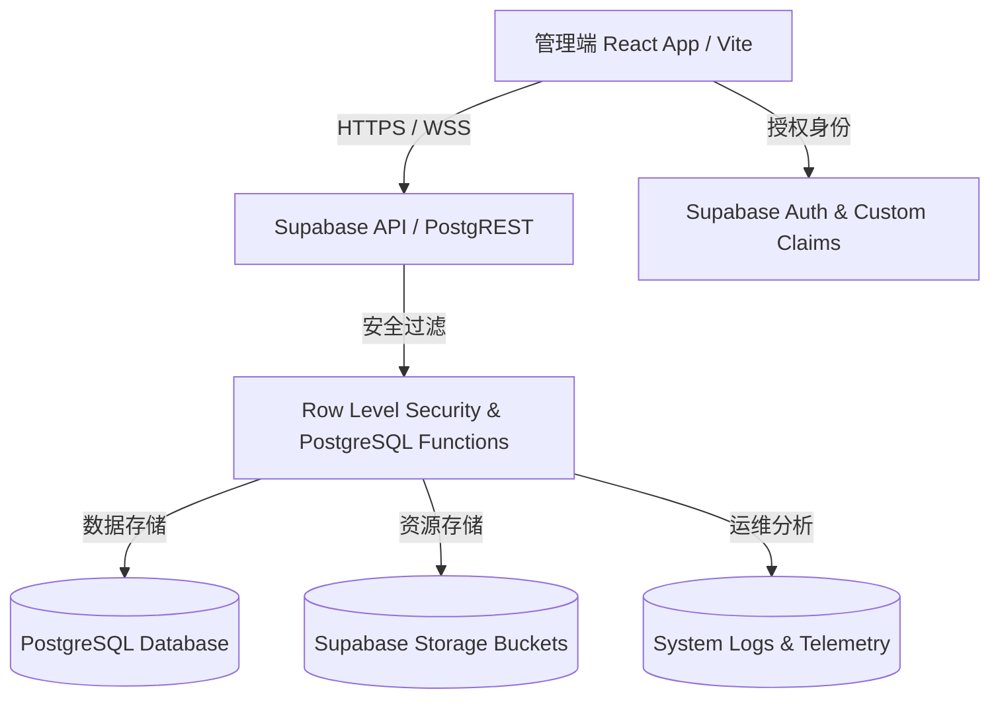
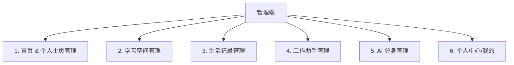

# Opclaw 后台管理系统设计与开发计划 (admin.md)

本章程旨在为 **Opclaw** 平台规范并规划一套企业级的后台管理系统（Admin Portal），用以全面管理、审核、统计和运维该平台的七大核心模块：“首页”、“学习空间”、“生活记录”、“工作助手”、“AI 分身”、“个人主页”、“我的”（个人中心）。

系统的设计原则为：**高安全性（RBAC）、双端自适应、实时遥测、Supabase 原生存取**。

---

## 📌 整体架构与技术选型

### 1. 架构示意图



### 2. 技术选型
- **前端核心**：React 18 + Vite (使用原有项目运行环境，保持打包与部署的统一性)
- **页面路由**：React Router v6，配置嵌套路由（`/admin`）及路由权限守卫
- **UI & 样式**：自适应 TailwindCSS 或项目现有的自研 HSL 主题样式系统
- **状态管理**：React Context + React Query (用于高效管理后台表格数据缓存及定期拉取)
- **图表展示**：ECharts / Recharts，对接统计模块的实时数据呈现
- **后端服务**：
  - **数据库与认证**：Supabase Auth + Database (PostgreSQL)
  - **云存储**：Supabase Storage (统一管理用户上传资源的审核与清理)
  - **实时推送**：Supabase Realtime (在审核队列与运维监控仪表盘中实现即时更新)

---

## 🔐 权限管理设计 (RBAC & Security)

为了在 Supabase 兼容的架构下区分普通用户与管理员，后台使用基于角色的访问控制（RBAC）。

### 1. 角色定义
- **超级管理员 (`admin`)**：拥有系统最高权限，可进行系统配置、用户角色变更、彻底删除数据、查看全部敏感日志及监控数据。
- **内容审核员 (`auditor`)**：专注于用户发布的内容审核，包括：留言墙、朋友圈、自定义文章、AI 分身分享以及图片资源。只拥有读取、屏蔽/打标签和操作审核队列的权限。
- **普通用户 (`user`)**：没有管理端系统的访问权限，任何尝试进入 `/admin` 的请求将被重定向或直接拒绝。

### 2. 数据库设计
为了存储并快速校验用户角色，我们将新建一张 `user_roles` 表：

```sql
CREATE TABLE IF NOT EXISTS public.user_roles (
  user_id UUID PRIMARY KEY REFERENCES auth.users(id) ON DELETE CASCADE,
  role TEXT NOT NULL CHECK (role IN ('admin', 'auditor', 'user')),
  assigned_by UUID REFERENCES auth.users(id) ON DELETE SET NULL,
  updated_at TIMESTAMP WITH TIME ZONE DEFAULT now() NOT NULL
);
```

### 3. PostgreSQL 安全辅助函数 (DB Helpers)
为避免在多张表的 RLS 中编写重复的 JOIN 查询，我们需要在 PostgreSQL 中创建高效的安全检查函数：

```sql
-- 检查当前操作的用户是否为管理员
CREATE OR REPLACE FUNCTION public.is_admin()
RETURNS BOOLEAN SECURITY DEFINER AS $$
BEGIN
  RETURN EXISTS (
    SELECT 1 FROM public.user_roles
    WHERE user_id = auth.uid() AND role = 'admin'
  );
END;
$$ LANGUAGE plpgsql;

-- 检查当前操作的用户是否为审核员
CREATE OR REPLACE FUNCTION public.is_auditor()
RETURNS BOOLEAN SECURITY DEFINER AS $$
BEGIN
  RETURN EXISTS (
    SELECT 1 FROM public.user_roles
    WHERE user_id = auth.uid() AND role IN ('admin', 'auditor')
  );
END;
$$ LANGUAGE plpgsql;
```

---

## 🗄️ 后台管理系统扩展表结构 (DDL Migration Plan)

为了实现管理端的审核、系统日志、系统设置和统计监控，在原数据库架构下追加 `0008_admin_system_schema.sql` 迁移文件：

```sql
-- e:\Code\AI\Start\Web\Opclaw\supabase\migrations\0008_admin_system_schema.sql

-- 1. 系统操作与运维日志表 (System Telemetry & Audit Logs)
CREATE TABLE IF NOT EXISTS public.system_logs (
  id UUID PRIMARY KEY DEFAULT gen_random_uuid(),
  user_id UUID REFERENCES auth.users(id) ON DELETE SET NULL,
  action TEXT NOT NULL,          -- 'user.block', 'post.delete', 'setting.update'
  level TEXT NOT NULL CHECK (level IN ('info', 'warning', 'error', 'critical')),
  details JSONB DEFAULT '{}'::jsonb,
  ip_address TEXT,
  user_agent TEXT,
  created_at TIMESTAMP WITH TIME ZONE DEFAULT now() NOT NULL
);

-- 2. 内容举报与待审核队列表 (Content Audit Queue)
CREATE TABLE IF NOT EXISTS public.content_audit_queues (
  id UUID PRIMARY KEY DEFAULT gen_random_uuid(),
  reporter_id UUID REFERENCES auth.users(id) ON DELETE SET NULL,
  target_table TEXT NOT NULL,    -- 'life_moments', 'danmaku_messages', 'learning_articles'
  target_id UUID NOT NULL,       -- 被举报或需审核的记录 ID
  reason TEXT NOT NULL,          -- 举报原因或触发自动审核词
  status TEXT DEFAULT 'pending' NOT NULL CHECK (status IN ('pending', 'approved', 'rejected')),
  reviewed_by UUID REFERENCES auth.users(id) ON DELETE SET NULL,
  review_notes TEXT,
  created_at TIMESTAMP WITH TIME ZONE DEFAULT now() NOT NULL,
  updated_at TIMESTAMP WITH TIME ZONE DEFAULT now() NOT NULL
);

-- 3. 系统配置参数表 (Global Application Settings)
CREATE TABLE IF NOT EXISTS public.system_settings (
  key TEXT PRIMARY KEY,
  value JSONB NOT NULL,
  updated_by UUID REFERENCES auth.users(id) ON DELETE SET NULL,
  updated_at TIMESTAMP WITH TIME ZONE DEFAULT now() NOT NULL
);

-- 4. 每日聚合统计表 (Daily Telemetry Statistics for charts)
CREATE TABLE IF NOT EXISTS public.daily_statistics (
  stat_date DATE PRIMARY KEY,
  dau INTEGER DEFAULT 0 NOT NULL,
  new_users INTEGER DEFAULT 0 NOT NULL,
  ai_chat_count INTEGER DEFAULT 0 NOT NULL,
  work_tasks_created INTEGER DEFAULT 0 NOT NULL,
  love_blessings_posted INTEGER DEFAULT 0 NOT NULL,
  storage_bytes_used BIGINT DEFAULT 0 NOT NULL
);

-- =========================================================================
-- RLS 安全策略设置 (Row Level Security & Policies)
-- =========================================================================

ALTER TABLE public.user_roles ENABLE ROW LEVEL SECURITY;
ALTER TABLE public.system_logs ENABLE ROW LEVEL SECURITY;
ALTER TABLE public.content_audit_queues ENABLE ROW LEVEL SECURITY;
ALTER TABLE public.system_settings ENABLE ROW LEVEL SECURITY;
ALTER TABLE public.daily_statistics ENABLE ROW LEVEL SECURITY;

-- user_roles: 仅超级管理员可读写分配，但所有登录用户在进行 RLS 判断时由 security definer 代理执行
CREATE POLICY "Super admin manage all user roles" ON public.user_roles
  FOR ALL TO authenticated USING (public.is_admin()) WITH CHECK (public.is_admin());

-- system_logs: 仅管理员可查看，所有经过认证的操作可发起插入
CREATE POLICY "Admins read system logs" ON public.system_logs
  FOR SELECT TO authenticated USING (public.is_admin());
CREATE POLICY "Allow system log insertions" ON public.system_logs
  FOR INSERT TO authenticated WITH CHECK (auth.uid() = user_id);

-- content_audit_queues: 审核员可查看和更新，普通用户可创建（提交举报）
CREATE POLICY "Auditors read/update queue" ON public.content_audit_queues
  FOR ALL TO authenticated USING (public.is_auditor()) WITH CHECK (public.is_auditor());
CREATE POLICY "Users insert reports" ON public.content_audit_queues
  FOR INSERT TO authenticated WITH CHECK (auth.uid() = reporter_id);

-- system_settings: 所有用户可 SELECT 读取，但仅 admin 能修改
CREATE POLICY "Anyone read system settings" ON public.system_settings FOR SELECT TO authenticated USING (true);
CREATE POLICY "Admins update settings" ON public.system_settings
  FOR ALL TO authenticated USING (public.is_admin()) WITH CHECK (public.is_admin());

-- daily_statistics: 仅审核员和管理员可查看
CREATE POLICY "Auditors view stats" ON public.daily_statistics
  FOR SELECT TO authenticated USING (public.is_auditor());
```

---

## 🎛️ 后台管理系统界面布局与响应式设计

后台管理系统独立配置路由 `/admin`。为保障桌面端和移动端的高效运维，界面采用 **自适应响应式多栏布局**。

```
+-------------------------------------------------------------+
|  [Sidebar Navigation]  |  [Header Bar]                      |
|  - Dashboard           |  - Active Page Title               |
|  - Users Manager       |  - Notifications & Audit Alerts    |
|  - Content Audit       |  - Admin Profile & Quick Logout    |
|  - Seven Core Modules  +------------------------------------+
|  - Telemetry & Logs    |                                    |
|  - Settings            |  [Main Dynamic Content Panel]      |
|                        |                                    |
+-------------------------------------------------------------+
```

### 1. 响应式规则 (Responsive Adaptation Rules)
- **桌面端 (Desktop - `md:flex` 及以上)**
  - 侧边导航栏固定悬浮于左侧（宽 240px），提供完整菜单和系统版本、数据库连接状态指示器。
  - 右侧主面板展示丰富的多列表格、ECharts 遥测折线图、多过滤下拉菜单。
- **移动端 (Mobile - `< md`)**
  - 侧边栏自动收缩，隐藏为抽屉组件（Sidebar Drawer），可通过左上角汉堡按钮呼出。
  - 数据表（Table）自动转换为卡片列表（Card List）模式展示，防止横向滚动条影响操作。
  - 审核弹窗和详情页采用全屏模式，方便移动端单手操作处理举报件。

---

## 🧩 七大核心功能模块管理划分 (Feature Modules)

后台针对 Opclaw 的七大核心业务模块实施差异化数据管理与配置管理：



### 1. 首页 & 个人主页管理 (Home & Portfolio Management)
- **数据管理**：读取并管理 `user_profiles` 表。管理员可查看每个用户的个人履历、展示的技能分类、项目集以及兴趣爱好等配置。
- **配置审核**：提供个人主页背景图、项目效果图的过滤列表。对违规的图片、项目描述或联系方式进行屏蔽与下线处理。

### 2. 学习空间管理 (Learning Space Management)
- **博文审核**：对普通用户在 `learning_articles` 中撰写的自定义博客文章进行审查。
- **在线简历**：提供对 `learning_resumes` 数据模型（JSON 结构）的安全审计，防范 XSS 漏洞植入。
- **聊天监控**：统计在 `learning_ai_chats` 中的总交互轮次、用户在 AI 助手里的 Token 流量及对话频次趋势。

### 3. 生活记录管理 (Life Record Management)
- **朋友圈审核**：重点监控 `life_moments`。管理端提供包含文本检索、发布日期检索的用户动态列表。允许管理员过滤并一键删除含有敏感词的 Moment，或清理违规图片。
- **时光轴与旅拍**：管理 `love_timeline` 与 `life_travel_locations`。支持审核上传的地图足迹、高精度 GPS 经纬度位置信息以及图片。
- **许愿清单与祝福板**：管理 `love_wishes` 和 `love_blessings`。由于祝福墙（Blessing Board）属于全站公开模块，后台需支持实时屏蔽及弹窗告警审核，防止出现网络小广告等非法内容。

### 4. 工作助手管理 (Work Assistant Management)
- **百宝箱网址审计**：在 `work_bookmarks` 中审查用户提交的第三方外部链接。如果发现恶意链接或跳转诈骗站，自动阻断并加入全站黑名单。
- **运营与电商监控**：监控新媒体帖子内容（`work_media_posts`）以及电商的虚假交易监控（`work_ecommerce` 中的商品上架列表与订单历史统计），以便协助处理售后争议。

### 5. AI 分身管理 (AI Character Management)
- **模型与存储审计**：监控 `ai_voice_clones` 与 `ai_avatar_clones` 的生成数量。对每个用户克隆声音和人脸时所占用的云端 OSS (Supabase Storage) 资源大小进行汇总监控，超出免费配额进行限额报警。
- **分享配置审查**：审计 `ai_shares` 的分享配置数据，如发现带有敏感定制系统提示词（System Prompt）的 AI 分身，进行下架和停用。

### 6. 我的 / 个人中心管理 (Social & Account Management)
- **用户基础资料**：查询和维护 `public.profiles`。支持按用户名、手机号、邮箱搜索用户，允许禁用/解锁账号。
- **名片生成审计**：查看生成的数字名片（`digital_cards`）历史与 pairing 日志（Nfc Pairing），管理默认头像列表。

---

## 📈 数据同步、审核与统计遥测规范

### 1. 数据实时同步机制 (Realtime Sync)
管理端采用 Supabase 的 Websocket Realtime 推送，对高敏感模块实行无刷实时呈现：
- **实时审核看板**：当用户举报某一 Moment 或 Danmaku 时，通过监听 `content_audit_queues` 表的 `INSERT` 动作，实时在审核人员后台播放警报音并动态插入待审队列。
- **实时运行日志**：在运维看板中，系统会监听并向前端推送 `system_logs` 的 `critical` 与 `error` 级别错误，无需轮询。

### 2. 内容自动审核流程 (Auto Audit & Human Review)
```
[用户发布/更新内容] -> [触发 Postgres Row Trigger]
                         |
                         v
       [本地正则敏感词校验 & AI 内容分析]
       /                               \
[通过: 正常展示]                [未通过: 标记为待审]
                                       |
                                       v
                             [插入 content_audit_queues]
                                       |
                                       v
                             [审核员: 批准/屏蔽操作]
```

### 3. 多维度数据统计看板
在后台核心“数据统计”菜单中，通过 React-ECharts 构建以下图表：
- **活跃用户数与注册量趋势 (折线图)**：通过对 `daily_statistics` 进行按时间段范围的 `SELECT` 渲染。
- **AI 资源消耗比 (饼图/雷达图)**：反映 SiliconFlow API 调用、文字转语音（TTS）、人脸重绘等资源开销分布。
- **各模块交互量占比 (柱状图)**：展示用户在生活记录、工作助手、学习空间的每日数据增长率。

---

## 🛠️ 运维与系统监控规范 (O&M Telemetry)

### 1. 错误边界处理 (Error Boundary)
前端使用 React `ErrorBoundary` 捕获组件渲染异常。若出现崩溃，展示美观的“后台系统重连中...”并自动调用日志接口，将错误详情（报错堆栈、异常组件、操作路由）上传至 `system_logs`。

### 2. 交互操作日志记录规范
任何后台管理员对用户数据的修改、禁用操作，**必须**同步记录入 `system_logs`。写入接口规范为：
```typescript
async function logAdminAction(
  supabase: SupabaseClient, 
  action: string, 
  level: 'info' | 'warning' | 'error' | 'critical',
  details: object
) {
  await supabase.from('system_logs').insert({
    action,
    level,
    details,
    ip_address: await getUserIp(), // 获取客户端IP
  });
}
```

### 3. API 性能监控
管理端会拦截 Axios / Supabase Client 的所有网络请求，并记录其响应耗时。如果某一 PostgREST 请求或 Edge Function 延迟超过 1500ms，自动上报 `system_logs`，日志级别定义为 `warning`，供开发团队调优数据库索引或硬件配置。

---

## 🗺️ 5 阶段后台系统开发路线图

| 阶段 | 核心任务 | 开发周期 | 交付物 |
| :--- | :--- | :--- | :--- |
| **Phase 1** | **数据库升级与权限配置** | 2 天 | 1. 部署 `0008_admin_system_schema.sql`；<br>2. 运行并测试 `is_admin()` 函数；<br>3. 初始化第一批管理员账号角色。 |
| **Phase 2** | **自适应框架与路由拦截** | 2 天 | 1. 搭建 `/admin` 路由守卫与重定向策略；<br>2. 编写桌面+移动端自适应 Sidebar/Drawer 骨架组件。 |
| **Phase 3** | **七大功能模块管理后台** | 3.5 天 | 1. 开发所有 7 模块的数据管理表格和操作面板；<br>2. 实现举报管理与内容一键下架/删除的数据库联锁操作。 |
| **Phase 4** | **统计与遥测运维板** | 2 天 | 1. 编写 `daily_statistics` 自动收集 Trigger；<br>2. 引入 ECharts 渲染 DAU 及 AI 开销占比折线/饼图；<br>3. 完成系统日志展示。 |
| **Phase 5** | **联合安全测试与上线** | 1.5 天 | 1. 执行并发压力测试，防范大量数据拉取时的超时；<br>2. 进行角色越权渗透测试；<br>3. 打包生成运行制品。 |

---

> [!CAUTION]
> **合规性与隐私保护警告**
> - 在展示用户的基础资料、聊天会话或简历数据时，管理端前端**必须**对身份证、手机号、邮箱、家庭地址等高度敏感的数据进行脱敏展示（例如 `138****0001`）。
> - 禁止在日志（System Logs）中记录任何用户的账号明文密码、银行账户、支付凭证或私人会话的具体对话正文，确保系统符合数据合规安全标准。
