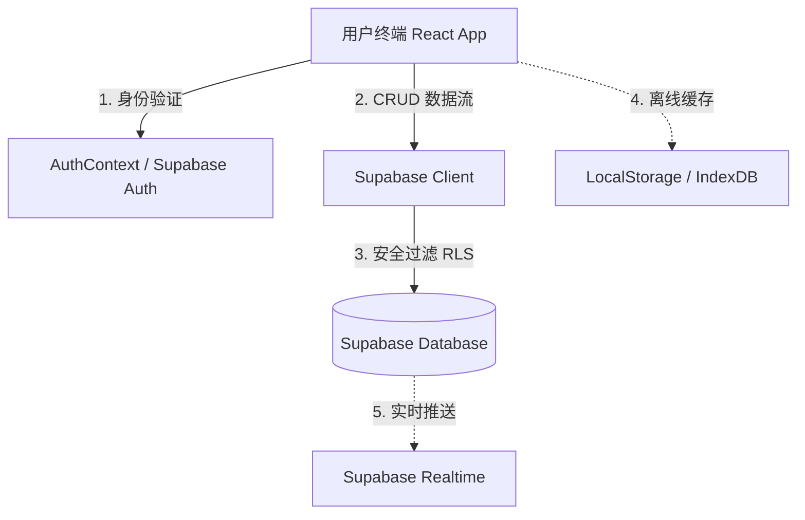

# Supabase 数据库多模块数据同步设计与开发计划 (sjk.md)

本章程旨在规范和规划 **Opclaw** 平台七大核心模块（首页、学习空间、生活记录、工作助手、AI 分身、个人主页、我的）的 Supabase 数据库同步方案。目前系统在多处使用内存状态、本地 Mock 数据或浏览器 `localStorage` 进行缓存，面临着“刷新丢失”、“多端无法共享”、“数据不安全”等问题。

通过本同步计划，我们将构建统一的 Supabase 数据存取层，实现全平台数据的云端双向同步、安全沙箱隔离（RLS），并保障离线降级与实时同步体验。

---

## 📌 整体架构与同步策略



### 1. 安全沙箱隔离（RLS - Row Level Security）
所有新创建的表必须开启 RLS，且每条记录均绑定 `user_id`（关联 `auth.users(id)`）。
- **查询 (SELECT)**：仅限经过身份验证的当前登录用户 (`auth.uid() = user_id`)，特殊共享场景（如数字名片、祝福墙、公开朋友圈）需定制特定 RLS Policy。
- **修改/删除 (INSERT, UPDATE, DELETE)**：严格限制 `auth.uid() = user_id`，防止越权操作。

### 2. 状态同步与离线降级机制
- **双向同步 (Sync Hook)**：使用自定义 React Hook（如 `useSyncState`），在组件挂载时从 Supabase 获取最新数据更新本地 State 并更新 `localStorage` 缓存；数据变更时，同步写入云端数据库与本地缓存。
- **离线降级**：若网络离线或 Supabase 服务不可用，系统自动 fallback 到 `localStorage` 读取和暂存，并在网络恢复后提示用户或自动执行增量同步。
- **防抖合并 (Debounced Update)**：对于频繁输入的数据（例如在线简历编辑、文字创作），采用 1-2 秒防抖机制，合并网络请求，减轻数据库写入压力。

---

## 🗄️ 数据库表结构设计 (DDL Migration Plan)

我们将在 `supabase/migrations/` 下新建 `0007_sync_modules_schema.sql` 迁移文件，定义以下数据表：

```sql
-- e:\Code\AI\Start\Web\Opclaw\supabase\migrations\0007_sync_modules_schema.sql

-- =========================================================================
-- 1. 首页 & 个人主页 & 我的 模块
-- =========================================================================

-- 1.1 个人主页配置表 (Home/Portfolio Editor 数据)
CREATE TABLE IF NOT EXISTS public.user_profiles (
  id UUID PRIMARY KEY REFERENCES auth.users (id) ON DELETE CASCADE,
  home_data JSONB NOT NULL DEFAULT '{}'::jsonb,
  updated_at TIMESTAMP WITH TIME ZONE DEFAULT now() NOT NULL
);

-- 1.2 友情链接表 (My Profile - Friend Links)
CREATE TABLE IF NOT EXISTS public.friend_links (
  id UUID PRIMARY KEY DEFAULT gen_random_uuid(),
  user_id UUID NOT NULL REFERENCES auth.users (id) ON DELETE CASCADE,
  name TEXT NOT NULL,
  url TEXT NOT NULL,
  description TEXT,
  initials TEXT,
  color TEXT DEFAULT '#3b82f6',
  created_at TIMESTAMP WITH TIME ZONE DEFAULT now() NOT NULL
);

-- 1.3 留言墙贴纸表 (My Profile - Danmaku Sticker Wall)
CREATE TABLE IF NOT EXISTS public.danmaku_messages (
  id UUID PRIMARY KEY DEFAULT gen_random_uuid(),
  user_id UUID NOT NULL REFERENCES auth.users (id) ON DELETE CASCADE,
  author TEXT NOT NULL,
  content TEXT NOT NULL,
  color JSONB NOT NULL DEFAULT '{"bg": "#fef3c7", "border": "#fbbf24", "text": "#92400e"}'::jsonb,
  rotation NUMERIC DEFAULT 0 NOT NULL,
  created_at TIMESTAMP WITH TIME ZONE DEFAULT now() NOT NULL
);

-- 1.4 生成的数字名片历史表 (My Profile - Digital Cards)
CREATE TABLE IF NOT EXISTS public.digital_cards (
  id UUID PRIMARY KEY DEFAULT gen_random_uuid(),
  user_id UUID NOT NULL REFERENCES auth.users (id) ON DELETE CASCADE,
  card_data JSONB NOT NULL,
  created_at TIMESTAMP WITH TIME ZONE DEFAULT now() NOT NULL
);


-- =========================================================================
-- 2. 学习空间 模块
-- =========================================================================

-- 2.1 学习空间 - 自定义博客文章表
CREATE TABLE IF NOT EXISTS public.learning_articles (
  id UUID PRIMARY KEY DEFAULT gen_random_uuid(),
  user_id UUID NOT NULL REFERENCES auth.users (id) ON DELETE CASCADE,
  title TEXT NOT NULL,
  content TEXT NOT NULL,
  category TEXT DEFAULT '默认分类',
  tags TEXT[] DEFAULT '{}'::TEXT[],
  created_at TIMESTAMP WITH TIME ZONE DEFAULT now() NOT NULL,
  updated_at TIMESTAMP WITH TIME ZONE DEFAULT now() NOT NULL
);

-- 2.2 学习空间 - 在线简历表
CREATE TABLE IF NOT EXISTS public.learning_resumes (
  user_id UUID PRIMARY KEY REFERENCES auth.users (id) ON DELETE CASCADE,
  resume_data JSONB NOT NULL DEFAULT '{}'::jsonb,
  updated_at TIMESTAMP WITH TIME ZONE DEFAULT now() NOT NULL
);

-- 2.3 学习空间 - AI 聊天历史表 (侧边栏及助手会话)
CREATE TABLE IF NOT EXISTS public.learning_ai_chats (
  id UUID PRIMARY KEY DEFAULT gen_random_uuid(),
  user_id UUID NOT NULL REFERENCES auth.users (id) ON DELETE CASCADE,
  messages JSONB NOT NULL DEFAULT '[]'::jsonb,
  created_at TIMESTAMP WITH TIME ZONE DEFAULT now() NOT NULL,
  updated_at TIMESTAMP WITH TIME ZONE DEFAULT now() NOT NULL
);


-- =========================================================================
-- 3. 生活记录 模块
-- =========================================================================

-- 3.1 恋爱记录 - 纪念日及双方信息配置表
CREATE TABLE IF NOT EXISTS public.love_couple_info (
  user_id UUID PRIMARY KEY REFERENCES auth.users (id) ON DELETE CASCADE,
  person1_name TEXT NOT NULL,
  person1_avatar TEXT,
  person2_name TEXT NOT NULL,
  person2_avatar TEXT,
  start_date TIMESTAMP WITH TIME ZONE NOT NULL,
  updated_at TIMESTAMP WITH TIME ZONE DEFAULT now() NOT NULL
);

-- 3.2 恋爱记录 - 时光时间线事件表
CREATE TABLE IF NOT EXISTS public.love_timeline (
  id UUID PRIMARY KEY DEFAULT gen_random_uuid(),
  user_id UUID NOT NULL REFERENCES auth.users (id) ON DELETE CASCADE,
  title TEXT NOT NULL,
  content TEXT NOT NULL,
  event_date DATE NOT NULL,
  images TEXT[] DEFAULT '{}'::TEXT[],
  created_at TIMESTAMP WITH TIME ZONE DEFAULT now() NOT NULL
);

-- 3.3 恋爱记录 - 许愿清单表
CREATE TABLE IF NOT EXISTS public.love_wishes (
  id UUID PRIMARY KEY DEFAULT gen_random_uuid(),
  user_id UUID NOT NULL REFERENCES auth.users (id) ON DELETE CASCADE,
  content TEXT NOT NULL,
  completed BOOLEAN DEFAULT false NOT NULL,
  priority TEXT DEFAULT 'medium' NOT NULL, -- 'low' | 'medium' | 'high'
  created_at TIMESTAMP WITH TIME ZONE DEFAULT now() NOT NULL
);

-- 3.4 恋爱记录 - 祝福墙留言表
CREATE TABLE IF NOT EXISTS public.love_blessings (
  id UUID PRIMARY KEY DEFAULT gen_random_uuid(),
  user_id UUID NOT NULL REFERENCES auth.users (id) ON DELETE CASCADE,
  author TEXT NOT NULL,
  content TEXT NOT NULL,
  color TEXT NOT NULL,
  likes INT DEFAULT 0 NOT NULL,
  created_at TIMESTAMP WITH TIME ZONE DEFAULT now() NOT NULL
);

-- 3.5 旅拍记录 - 脚印标记与位置表
CREATE TABLE IF NOT EXISTS public.life_travel_locations (
  id UUID PRIMARY KEY DEFAULT gen_random_uuid(),
  user_id UUID NOT NULL REFERENCES auth.users (id) ON DELETE CASCADE,
  name TEXT NOT NULL,
  lat NUMERIC NOT NULL,
  lng NUMERIC NOT NULL,
  description TEXT,
  images TEXT[] DEFAULT '{}'::TEXT[],
  visit_date DATE,
  created_at TIMESTAMP WITH TIME ZONE DEFAULT now() NOT NULL
);

-- 3.6 朋友圈动态表 (Moments)
CREATE TABLE IF NOT EXISTS public.life_moments (
  id UUID PRIMARY KEY DEFAULT gen_random_uuid(),
  user_id UUID NOT NULL REFERENCES auth.users (id) ON DELETE CASCADE,
  content TEXT NOT NULL,
  images TEXT[] DEFAULT '{}'::TEXT[],
  likes TEXT[] DEFAULT '{}'::TEXT[], -- 存储点赞用户名或ID的数组
  comments JSONB DEFAULT '[]'::jsonb, -- 存储评论列表的JSONB
  created_at TIMESTAMP WITH TIME ZONE DEFAULT now() NOT NULL
);

-- 3.7 个人娱乐集成表 (音乐盒、收藏电影、运动记录、游戏记录)
CREATE TABLE IF NOT EXISTS public.life_entertainment (
  user_id UUID PRIMARY KEY REFERENCES auth.users (id) ON DELETE CASCADE,
  music_list JSONB DEFAULT '[]'::jsonb,
  movie_list JSONB DEFAULT '[]'::jsonb,
  sports_data JSONB DEFAULT '{}'::jsonb,
  games_data JSONB DEFAULT '{}'::jsonb,
  updated_at TIMESTAMP WITH TIME ZONE DEFAULT now() NOT NULL
);


-- =========================================================================
-- 4. 工作助手 模块
-- =========================================================================

-- 4.1 百宝箱网址导航表
CREATE TABLE IF NOT EXISTS public.work_bookmarks (
  id UUID PRIMARY KEY DEFAULT gen_random_uuid(),
  user_id UUID NOT NULL REFERENCES auth.users (id) ON DELETE CASCADE,
  name TEXT NOT NULL,
  url TEXT NOT NULL,
  category TEXT DEFAULT '常用',
  created_at TIMESTAMP WITH TIME ZONE DEFAULT now() NOT NULL
);

-- 4.2 新媒体内容库表
CREATE TABLE IF NOT EXISTS public.work_media_contents (
  id UUID PRIMARY KEY DEFAULT gen_random_uuid(),
  user_id UUID NOT NULL REFERENCES auth.users (id) ON DELETE CASCADE,
  title TEXT NOT NULL,
  type TEXT NOT NULL, -- 'article' | 'video' | 'image'
  description TEXT,
  url TEXT,
  thumbnail TEXT,
  tags TEXT[] DEFAULT '{}'::TEXT[],
  platform TEXT NOT NULL,
  created_at TIMESTAMP WITH TIME ZONE DEFAULT now() NOT NULL
);

-- 4.3 新媒体发布管理表
CREATE TABLE IF NOT EXISTS public.work_media_posts (
  id UUID PRIMARY KEY DEFAULT gen_random_uuid(),
  user_id UUID NOT NULL REFERENCES auth.users (id) ON DELETE CASCADE,
  title TEXT NOT NULL,
  content TEXT NOT NULL,
  platform TEXT NOT NULL,
  status TEXT NOT NULL, -- 'draft' | 'published' | 'scheduled'
  images TEXT[] DEFAULT '{}'::TEXT[],
  likes INT DEFAULT 0 NOT NULL,
  comments INT DEFAULT 0 NOT NULL,
  shares INT DEFAULT 0 NOT NULL,
  views INT DEFAULT 0 NOT NULL,
  created_at TIMESTAMP WITH TIME ZONE DEFAULT now() NOT NULL,
  scheduled_at TIMESTAMP WITH TIME ZONE
);

-- 4.4 电商运营数据表 (合集：商品列表及订单管理)
CREATE TABLE IF NOT EXISTS public.work_ecommerce (
  user_id UUID PRIMARY KEY REFERENCES auth.users (id) ON DELETE CASCADE,
  products JSONB DEFAULT '[]'::jsonb,
  orders JSONB DEFAULT '[]'::jsonb,
  updated_at TIMESTAMP WITH TIME ZONE DEFAULT now() NOT NULL
);


-- =========================================================================
-- 5. AI 分身 模块
-- =========================================================================

-- 5.1 AI 分身 - 聊天会话表
CREATE TABLE IF NOT EXISTS public.ai_sessions (
  id UUID PRIMARY KEY DEFAULT gen_random_uuid(),
  user_id UUID NOT NULL REFERENCES auth.users (id) ON DELETE CASCADE,
  title TEXT NOT NULL,
  character_name TEXT DEFAULT '小梦' NOT NULL,
  messages JSONB NOT NULL DEFAULT '[]'::jsonb,
  created_at TIMESTAMP WITH TIME ZONE DEFAULT now() NOT NULL,
  updated_at TIMESTAMP WITH TIME ZONE DEFAULT now() NOT NULL
);

-- 5.2 AI 分身 - 声音克隆配置表
CREATE TABLE IF NOT EXISTS public.ai_voice_clones (
  user_id UUID PRIMARY KEY REFERENCES auth.users (id) ON DELETE CASCADE,
  voice_model JSONB NOT NULL,
  updated_at TIMESTAMP WITH TIME ZONE DEFAULT now() NOT NULL
);

-- 5.3 AI 分身 - 形象克隆配置表
CREATE TABLE IF NOT EXISTS public.ai_avatar_clones (
  user_id UUID PRIMARY KEY REFERENCES auth.users (id) ON DELETE CASCADE,
  avatar_model JSONB NOT NULL,
  updated_at TIMESTAMP WITH TIME ZONE DEFAULT now() NOT NULL
);

-- 5.4 AI 分身 - 配置分享表
CREATE TABLE IF NOT EXISTS public.ai_shares (
  id UUID PRIMARY KEY DEFAULT gen_random_uuid(),
  user_id UUID NOT NULL REFERENCES auth.users (id) ON DELETE CASCADE,
  share_id TEXT UNIQUE NOT NULL,
  config JSONB NOT NULL,
  created_at TIMESTAMP WITH TIME ZONE DEFAULT now() NOT NULL
);


-- =========================================================================
-- RLS 安全策略设置 (Row Level Security & Policies)
-- =========================================================================

-- 开启所有新表的 RLS
ALTER TABLE public.user_profiles ENABLE ROW LEVEL SECURITY;
ALTER TABLE public.friend_links ENABLE ROW LEVEL SECURITY;
ALTER TABLE public.danmaku_messages ENABLE ROW LEVEL SECURITY;
ALTER TABLE public.digital_cards ENABLE ROW LEVEL SECURITY;
ALTER TABLE public.learning_articles ENABLE ROW LEVEL SECURITY;
ALTER TABLE public.learning_resumes ENABLE ROW LEVEL SECURITY;
ALTER TABLE public.learning_ai_chats ENABLE ROW LEVEL SECURITY;
ALTER TABLE public.love_couple_info ENABLE ROW LEVEL SECURITY;
ALTER TABLE public.love_timeline ENABLE ROW LEVEL SECURITY;
ALTER TABLE public.love_wishes ENABLE ROW LEVEL SECURITY;
ALTER TABLE public.love_blessings ENABLE ROW LEVEL SECURITY;
ALTER TABLE public.life_travel_locations ENABLE ROW LEVEL SECURITY;
ALTER TABLE public.life_moments ENABLE ROW LEVEL SECURITY;
ALTER TABLE public.life_entertainment ENABLE ROW LEVEL SECURITY;
ALTER TABLE public.work_bookmarks ENABLE ROW LEVEL SECURITY;
ALTER TABLE public.work_media_contents ENABLE ROW LEVEL SECURITY;
ALTER TABLE public.work_media_posts ENABLE ROW LEVEL SECURITY;
ALTER TABLE public.work_ecommerce ENABLE ROW LEVEL SECURITY;
ALTER TABLE public.ai_sessions ENABLE ROW LEVEL SECURITY;
ALTER TABLE public.ai_voice_clones ENABLE ROW LEVEL SECURITY;
ALTER TABLE public.ai_avatar_clones ENABLE ROW LEVEL SECURITY;
ALTER TABLE public.ai_shares ENABLE ROW LEVEL SECURITY;

-- 简易全局规则：经过身份验证的用户仅能对属于自己 (user_id = auth.uid()) 的数据进行 CRUD 操作
-- 对于主键即为 user_id 的表，使用 (id = auth.uid()) 或 (user_id = auth.uid()) 策略

-- user_profiles (个人主页配置)
CREATE POLICY "Manage own user profile" ON public.user_profiles
  FOR ALL TO authenticated USING (auth.uid() = id) WITH CHECK (auth.uid() = id);

-- friend_links
CREATE POLICY "Manage own friend links" ON public.friend_links
  FOR ALL TO authenticated USING (auth.uid() = user_id) WITH CHECK (auth.uid() = user_id);

-- danmaku_messages (留言墙) - 所有人可读，但仅自己能修改/删除
CREATE POLICY "Read all danmaku" ON public.danmaku_messages FOR SELECT TO authenticated USING (true);
CREATE POLICY "Manage own danmaku" ON public.danmaku_messages 
  FOR ALL TO authenticated USING (auth.uid() = user_id) WITH CHECK (auth.uid() = user_id);

-- digital_cards
CREATE POLICY "Manage own digital cards" ON public.digital_cards
  FOR ALL TO authenticated USING (auth.uid() = user_id) WITH CHECK (auth.uid() = user_id);

-- learning_articles
CREATE POLICY "Manage own learning articles" ON public.learning_articles
  FOR ALL TO authenticated USING (auth.uid() = user_id) WITH CHECK (auth.uid() = user_id);

-- learning_resumes
CREATE POLICY "Manage own resume" ON public.learning_resumes
  FOR ALL TO authenticated USING (auth.uid() = user_id) WITH CHECK (auth.uid() = user_id);

-- learning_ai_chats
CREATE POLICY "Manage own AI chat history" ON public.learning_ai_chats
  FOR ALL TO authenticated USING (auth.uid() = user_id) WITH CHECK (auth.uid() = user_id);

-- love_couple_info
CREATE POLICY "Manage own couple info" ON public.love_couple_info
  FOR ALL TO authenticated USING (auth.uid() = user_id) WITH CHECK (auth.uid() = user_id);

-- love_timeline
CREATE POLICY "Manage own love timeline" ON public.love_timeline
  FOR ALL TO authenticated USING (auth.uid() = user_id) WITH CHECK (auth.uid() = user_id);

-- love_wishes
CREATE POLICY "Manage own love wishes" ON public.love_wishes
  FOR ALL TO authenticated USING (auth.uid() = user_id) WITH CHECK (auth.uid() = user_id);

-- love_blessings (祝福墙) - 允许读取和写入（广场属性），但仅自己可以删除
CREATE POLICY "Read all love blessings" ON public.love_blessings FOR SELECT TO authenticated USING (true);
CREATE POLICY "Create love blessings" ON public.love_blessings FOR INSERT TO authenticated WITH CHECK (auth.uid() = user_id);
CREATE POLICY "Manage own love blessings" ON public.love_blessings 
  FOR UPDATE, DELETE TO authenticated USING (auth.uid() = user_id);

-- life_travel_locations
CREATE POLICY "Manage own travel locations" ON public.life_travel_locations
  FOR ALL TO authenticated USING (auth.uid() = user_id) WITH CHECK (auth.uid() = user_id);

-- life_moments (朋友圈) - 所有人可读，仅作者能增删改
CREATE POLICY "Read all life moments" ON public.life_moments FOR SELECT TO authenticated USING (true);
CREATE POLICY "Manage own life moments" ON public.life_moments
  FOR ALL TO authenticated USING (auth.uid() = user_id) WITH CHECK (auth.uid() = user_id);

-- life_entertainment
CREATE POLICY "Manage own entertainment data" ON public.life_entertainment
  FOR ALL TO authenticated USING (auth.uid() = user_id) WITH CHECK (auth.uid() = user_id);

-- work_bookmarks
CREATE POLICY "Manage own bookmarks" ON public.work_bookmarks
  FOR ALL TO authenticated USING (auth.uid() = user_id) WITH CHECK (auth.uid() = user_id);

-- work_media_contents
CREATE POLICY "Manage own media contents" ON public.work_media_contents
  FOR ALL TO authenticated USING (auth.uid() = user_id) WITH CHECK (auth.uid() = user_id);

-- work_media_posts
CREATE POLICY "Manage own media posts" ON public.work_media_posts
  FOR ALL TO authenticated USING (auth.uid() = user_id) WITH CHECK (auth.uid() = user_id);

-- work_ecommerce
CREATE POLICY "Manage own ecommerce operations" ON public.work_ecommerce
  FOR ALL TO authenticated USING (auth.uid() = user_id) WITH CHECK (auth.uid() = user_id);

-- ai_sessions
CREATE POLICY "Manage own AI sessions" ON public.ai_sessions
  FOR ALL TO authenticated USING (auth.uid() = user_id) WITH CHECK (auth.uid() = user_id);

-- ai_voice_clones
CREATE POLICY "Manage own cloned voices" ON public.ai_voice_clones
  FOR ALL TO authenticated USING (auth.uid() = user_id) WITH CHECK (auth.uid() = user_id);

-- ai_avatar_clones
CREATE POLICY "Manage own cloned avatars" ON public.ai_avatar_clones
  FOR ALL TO authenticated USING (auth.uid() = user_id) WITH CHECK (auth.uid() = user_id);

-- ai_shares (分享链接配置) - 所有人可根据 share_id 读取，仅创建者可管理
CREATE POLICY "Read all AI shares" ON public.ai_shares FOR SELECT USING (true);
CREATE POLICY "Manage own AI shares" ON public.ai_shares 
  FOR ALL TO authenticated USING (auth.uid() = user_id) WITH CHECK (auth.uid() = user_id);
```

---

## 🔧 前端同步逻辑改造细则 (Implementation Code Modification)

### 1. 首页 (Home) / 个人主页 (Profile) / 我的 (Social)
- **更新 `user_profiles` 迁移支持**
  - 目前 `useHomeEditor.ts` 已经实现了与 Supabase 表 `user_profiles` 的同步。我们在数据库层面补充该表的定义（如上文 SQL DDL 所示），即可确保现有代码完美运行。
- **改造 `Social.tsx` ("我的")**
  - **友情链接 (Friend Links)**：
    将 `const [links, setLinks] = useState(friendLinks)` 改为使用自定义 Hook 或在页面加载时执行异步查询：
    ```typescript
    useEffect(() => {
      if (!isAuthenticated) return;
      supabase.from('friend_links').select('*').order('created_at', { ascending: true })
        .then(({ data }) => data && setLinks(data));
    }, [isAuthenticated]);
    // 增加数据时执行 supabase.from('friend_links').insert({...})
    ```
  - **留言墙 (Danmaku sticker)**：
    同样，在 `DanmakuWall` 中增加 Supabase 的 `SELECT`, `INSERT`, `DELETE` 及点赞更新操作。
  - **数字名片 (Digital Card)**：
    目前生成名片后会调用 `saveToHistory` 存储至 `localStorage.getItem('card_history')`。改写 `cardUtils.ts` 中的 `saveToHistory` 函数，优先调用 Supabase `digital_cards` 表进行插入。

### 2. 学习空间 (Learning Space)
- **改造文章库与创作功能 (`Learning.tsx`)**
  - 将当前页面的 React 内存状态 `customArticles` 改为从 `learning_articles` 数据表中读取。
  - 用户导入 Markdown 文件或在编辑器保存时，发起 `INSERT` 或 `UPDATE` 请求，同步更新云端。
- **改造在线简历 (`src/components/learning/resume/useResume.ts`)**
  - 拦截目前的 `localStorage.getItem(STORAGE_KEY)` 和 `setItem`，在用户登录时：
    - 读取：优先从 Supabase `learning_resumes` 表中获取。若无数据，回退到本地缓存。
    - 保存：防抖（如 1.5 秒）同步上传 `resume_data`。

### 3. 生活记录 (Life Record)
- **时光轴数据同步 (`Life.tsx` -> `LoveTimeline`)**
  - 恋爱记录的时间线目前从静态 `initialLoveTimeline` 读取。新增云端拉取，将用户自定义添加的纪念日/里程碑事件追加至列表。
- **许愿清单 (`WishList.tsx`)**
  - 改写首屏加载，使用：
    ```typescript
    const { data } = await supabase.from('love_wishes').select('*').order('created_at', { ascending: false });
    ```
  - `addWish`、`toggleWish`、`deleteWish` 和 `saveEdit` 均增加 Supabase CRUD 接口调用。
- **祝福墙 (`BlessingBoard.tsx`)**
  - 加载：拉取 `love_blessings`。
  - 写入：添加祝福时插入一行，其中 `color` 存储为 CSS 十六进制值。
  - 点赞：通过 Supabase `update` 对 `likes = likes + 1` 进行累加操作。

### 4. 工作助手 (Work Assistant)
- **新媒体内容库与发布管理 (`Work.tsx` -> `NewMediaModule`)**
  - 针对目前 `contents` 与 `posts` 为只读静态数组且“确定删除”无实际行为的问题：
    1. 声明 `contents` 和 `posts` 的 React State。
    2. 加载时从 Supabase `work_media_contents` 和 `work_media_posts` 拉取个人专属数据。
    3. 点击删除时，在前端过滤的同时，调用 `supabase.from(...).delete().eq('id', id)` 保证数据库状态一致。

### 5. AI 分身 (AI Character)
- **聊天历史会话管理 (`AICharacter.tsx`)**
  - `sessions` 的初始化和持久化（目前是 `ai_chat_sessions` LocalStorage 键）全面切至 `ai_sessions` 表。
- **声音克隆与形象克隆**
  - 声音与形象克隆产生的 JSON 配置（含 SiliconFlow 语音 ID、图片 Url 及参数）在克隆成功后，调用 `ai_voice_clones` 和 `ai_avatar_clones` 的 `upsert` 命令保存。
- **分享分身链接**
  - 用户分享分身配置时，将整个配置加密并上传至 `ai_shares` 表，生成全局唯一的 `share_id`。其他用户输入该 `share_id` 即可跨账户恢复模型参数。

---

## 📅 同步开发计划与排期进度

整个 Supabase 同步开发将划分为五个阶段，总体预计耗时 10 个工作日。

| 阶段 | 任务目标 | 核心工作内容 | 预计耗时 |
| :--- | :--- | :--- | :--- |
| **Phase 1** | **基础设施与数据库迁移** | 1. 编写并运行 `0007_sync_modules_schema.sql` 迁移脚本；<br>2. 验证本地 Supabase 容器/云端表及 RLS Policy 正确性；<br>3. 检查 `AuthContext` 对 RLS token 的自动注入。 | 2 天 |
| **Phase 2** | **主页、个人主页与“我的”同步** | 1. 修改 `useHomeEditor.ts` 适配 `user_profiles`；<br>2. 改造 `Social.tsx` 页面下的友链、留言墙、数字名片同步；<br>3. 验证头像、背景更换的多端即时生效。 | 2 天 |
| **Phase 3** | **学习空间与 AI 分身同步** | 1. 改造 `useResume.ts` 简历同步及 `Learning.tsx` 文章保存；<br>2. 改造 `AICharacter.tsx` 聊天历史会话、克隆模型及分享链接的云端存储。 | 2 天 |
| **Phase 4** | **生活记录与工作助手同步** | 1. 在 `Life.tsx` 引入许愿清单、祝福板、时光轴和足迹地图的 CRUD 操作；<br>2. 补充 `Work.tsx` 网页百宝箱导航、新媒体内容与发布任务的云端读写。 | 2.5 天 |
| **Phase 5** | **联调测试与性能优化** | 1. 测试各模块在未登录状态下的 AuthModal 强制拦截逻辑；<br>2. 模拟弱网/离线情况，验证 `localStorage` 的 Fallback 体验；<br>3. 修复潜在的 RLS 权限拒绝及并发读写冲突。 | 1.5 天 |

---

> [!IMPORTANT]
> **关于图片/文件存储同步**
> - 用户上传的数字名片背景、头像、朋友圈配图、时间线纪念日照片等，一律利用现有 Supabase Storage 的 `public-assets` 桶进行存储。
> - 在数据库写入记录前，需先调用 `supabase.storage.from('public-assets').upload()` 上传资源，取得返回的 Public URL 后再写入对应的文本/数组字段中。

> [!TIP]
> **开发调试说明**
> - 在开发阶段，可随时通过本地终端运行 `supabase db pull` 或 `supabase db push` 来同步和刷新本地开发环境的数据库 schema。
> - 如遇到 RLS 引起的 `401 Unauthorized` 报错，请确认请求头中是否正确带上了 Authorization JWT Token，或检查 `supabase.auth.getSession()` 是否为空。
