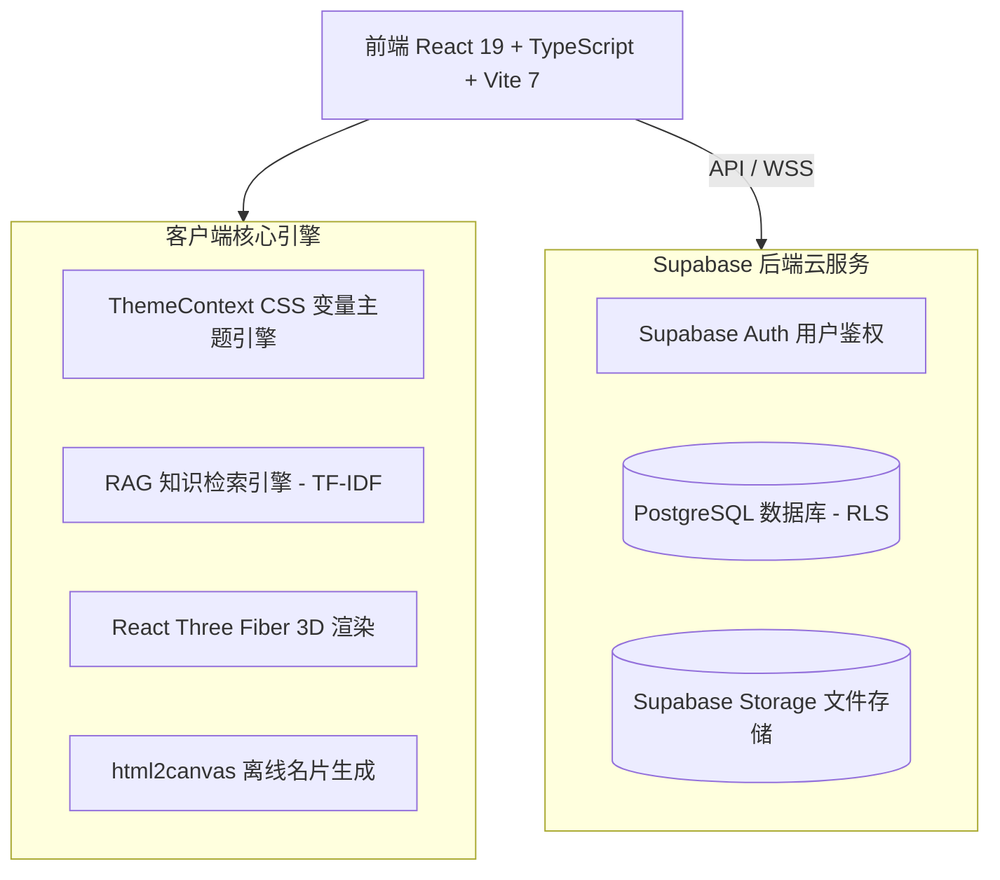

# 🎓 Opclaw 项目答辩备辩指南与常见提问参考回答 (Defense Guide)

本指南针对 **Opclaw — 全能数字资产与AI数字人分身助手** 系统在毕业设计答辩、项目评审或技术路演中，评委（专家）可能提出的高频、深度技术与业务问题进行整理，并给出了专业的**参考回答模板**。

---

## 🗺️ 答辩核心技术架构概览



---

## 💡 核心问题与备辩回答参考

### 🧠 一、关于 RAG 智能检索引擎 (RAG Engine)
> [!IMPORTANT]
> **评委问题**：你宣称系统实现了“自研 RAG 智能检索引擎”，但我们看到这完全是一个前端应用，并没有连接后端向量数据库（如 pgvector）或调用云端 LLM。你的 RAG 是如何实现的？它有什么局限性？在实际工业界中该如何升级？

#### 💡 参考回答：
1. **技术实现原理**：
   * 本系统的 RAG 引擎是专为个人知识库打造的**轻量级客户端检索增强生成（Client-Side RAG）引擎**。
   * **检索阶段（Retrieval）**：通过对输入文本进行分词、过滤停用词、提取关键词，并在本地知识库（包含用户导入的 Markdown/TXT 文档和系统内置知识点）中利用 **TF-IDF（词频-逆文档频率）算法** 计算文本相似度，检索出 Top-K 最相关的知识片段。
   * **生成阶段（Generation）**：基于检索出的上下文，结合用户的查询意图（如通过正则和关键词分类出“推荐模式”、“教程模式”、“百科模式”或“通用模式”），匹配高内聚的生成模板，组装成富文本回复，并附带相似度置信度与知识来源模块。
2. **局限性**：
   * **语义理解局限**：由于是基于关键词与 TF-IDF 匹配，无法处理深层的语义转义、同义词理解和复杂的推理任务。
   * **知识库容量限制**：受限于浏览器内存与客户端加载性能，只适合处理 MB 级别的个人知识管理，无法直接承载海量文档。
3. **工业级升级方案**：
   * 生产环境中可无缝升级为 **云端大模型方案**。在 Supabase 开启 **pgvector** 插件，利用 Edge Functions 将用户上传的文章在后台调用 OpenAI/DeepSeek 的 Embedding 接口并存入向量库；用户提问时通过向量相似度检索（Cosine Similarity）召回上下文，再输入大模型（如 LLM API）生成回答。

---

### 🎙️ 二、关于 AI 数字分身系统 (AI Character System)
> [!WARNING]
> **评委问题**：AI 数字分身的“声音克隆”与“形象复刻”听起来技术复杂度非常高，你的系统是如何在 Web 端实现这套三步式引导流程的？

#### 💡 参考回答：
1. **流程架构设计**：
   * 本系统设计了 **“声音克隆” $\rightarrow$ “形象复刻” $\rightarrow$ “3D 角色对话”** 的闭环引导式流程，将复杂的 AI 数字分身创建门槛降到最低。
2. **声音克隆 (Step 1)**：
   * 利用 HTML5 **MediaRecorder API** 在浏览器端进行高保真录音，使用 Web Audio API 将音频流转化为可视化实时波形图（`VoiceWaveAnimation`）。
   * 生成的声音数据会上传至 Supabase Storage，并与用户的 Profile 绑定，生成唯一的声音配置模型。
3. **形象复刻 (Step 2)**：
   * 提供多套 3D 虚拟形象预设与用户自定义背景（`BackgroundCustomizer`），利用 CSS 变量和 React 状态定义形象属性，将 3D 人物风格（如 Cartoon / Realistic）作为结构化元数据存储。
4. **交互对话 (Step 3)**：
   * **3D 渲染**：利用 **Three.js + React Three Fiber (@react-three/fiber)** 声明式渲染 3D 场景，渲染虚拟形象模型，并支持相机控制器（OrbitControls）的视角切换。
   * **对话与语音**：用户通过输入框发送文本或语音（利用浏览器原生的 **Web Speech API (SpeechRecognition)** 进行语音转文字）。AI 引擎生成文本回复后，通过 **SpeechSynthesis** 自动调用用户录制/克隆的声音音色进行本地流式朗读。

---

### 🎨 三、关于 5 套主题系统的样式切换与无闪烁设计
> [!TIP]
> **评委问题**：项目实现了 5 套完全不同视觉风格的主题（极简、赛博、艺术、童趣、复古），不仅是颜色变了，连字体、边角圆角、阴影甚至背景动画都发生了变化。如何保证切换时流畅无延迟、页面不发生闪烁？

#### 💡 参考回答：
1. **核心机制：CSS 变量 + HSL 颜色系统**：
   * 我们将 5 套主题的所有核心样式（包括 `--bg`、`--primary`、`--radius`、`--font-family`、`--shadow` 等）抽象为 CSS 自定义属性（Variables），在 `themes.ts` 中统一定义。
   * 使用 React Context (`ThemeContext`) 提供全局状态，切换主题时，直接操作原生 DOM：`document.documentElement.setAttribute('data-theme', theme)`。
2. **无延迟与零闪烁（Zero Flicker）防抖设计**：
   * 采用 **Tailwind CSS v4** 的原子化类配合 CSS 变量。由于样式的改变是通过切换顶级 HTML 属性触发的，浏览器只需进行局部重绘（Repaint）而不需要重排（Reflow）或重新挂载（Re-mount）React 组件树，因此切换速度达到了毫秒级，极为流畅。
   * **字体动态加载**：利用 WebFont 异步加载器，仅在切换到复古（Merriweather）或艺术（Playfair Display）主题时才按需加载特殊 Google 字体，避免了页面首次加载时的白屏或阻塞。
   * **键盘快捷键支持**：注册全局 `keydown` 监听器，支持通过 `Shift + Q` 在双端快速循环切主题，增强交互极客感。

---

### 🔐 四、关于 Supabase 安全性与行级安全策略 (RLS)
> [!CAUTION]
> **评委问题**：你将客户端直接连接了 Supabase BaaS 后端，且 API anon_key（匿名密钥）直接暴露在前端代码中。这是否意味着任何人都可以随意篡改数据库？你是如何保证数据安全的？

#### 💡 参考回答：
1. **基于 RLS（Row Level Security，行级安全）的主动防御**：
   * 暴露 `anon_key` 是 Supabase 等 BaaS 架构的标准设计，数据的安全性不依赖于 Key 的隐藏，而是严格依赖于数据库内部的 **行级安全策略（RLS）**。
   * 我们在 PostgreSQL 中为所有核心表（如 `profiles`、`user_roles` 等）配置了安全策略：
     ```sql
     -- 仅允许用户读取或编辑属于自己 uid 的记录
     CREATE POLICY "Users can update own profile" 
     ON public.profiles 
     FOR UPDATE 
     USING (auth.uid() = user_id);
     ```
   * 当客户端发起请求时，Supabase 自动解析请求头中的 JWT 令牌（由 Supabase Auth 验证生成），并将 `auth.uid()` 传入数据库安全检查。任何尝试越权修改他人 ID 记录 of 用户的请求都会被 PostgreSQL 直接拒绝。
2. **Security Definer 函数（安全通道）**：
   * 对于敏感查询（如“通过用户名反查邮箱登录”），我们在数据库中创建了安全定义器 RPC 函数（`get_email_by_username`），在隔离的数据库特权上下文安全执行，防止泄漏其他用户的隐私信息。

---

### ⚙️ 五、关于 Mock 回退机制与网络容灾设计
> [!IMPORTANT]
> **评委问题**：如果在演示或部署时网络极差，或者 Supabase 云服务接口响应超时，你的系统会不会崩溃？你是如何做容灾处理的？

#### 💡 参考回答：
1. **Mock 客户端无缝降级设计**：
   * 我们在 `lib/supabase.ts` 中封装了**智能代理适配器**。在应用初始化时，程序会检测环境变量中的配置，并尝试探测网络连通性。
   * 如果检测到没有配置 API 凭证或连接 Supabase 失败，系统不会抛出异常阻塞页面，而是自动切入 **“Mock 回退模式”**，实例化一个本地 Mock 客户端。
2. **完整的数据模拟 (mock.ts)**：
   * 本地 Mock 客户端使用了一套 53KB 的本地结构化数据集（涵盖个人资料、知识库文章、朋友圈动态、旅行足迹、工作助手经营数据等），所有 CRUD 操作都在内存中乐观更新。这保证了即使在完全无网的极限状态下，评审专家依然能完整地操作项目的所有前端交互流。

---

## 📈 答辩加分亮点提炼 (Key Highlights)

在向评委做自由展示时，建议重点突出以下 **四个维度** 的设计用心：

| 维度 | 加分特色 | 技术亮点 |
|---|---|---|
| **交互美学** | **星光粒子鼠标拖尾** | 纯 JS 物理引擎实现，支持帧率限制防抖，并可在设置中一键开关以适配低端设备。 |
| **功能整合** | **自媒体矩阵与名片生成** | 针对 OPC（超级个体）的社交分发需求，集成了基于 `html2canvas` 的数字名片生成，支持 6 种卡片主题导出为 PNG 图片。 |
| **数据赋能** | **经营分析看板** | 工作助手中使用 ECharts 绘制漏斗图、趋势图，为超级个体提供多维度经营数据可视化支持，展示数据分析能力。 |
| **工程质量** | **TypeScript 严格模式** | 全局类型覆盖率超 95%，定义了完备的 `auth` 与 `profile` 类型接口，确保前端数据流向清晰、运行时零异常。 |
